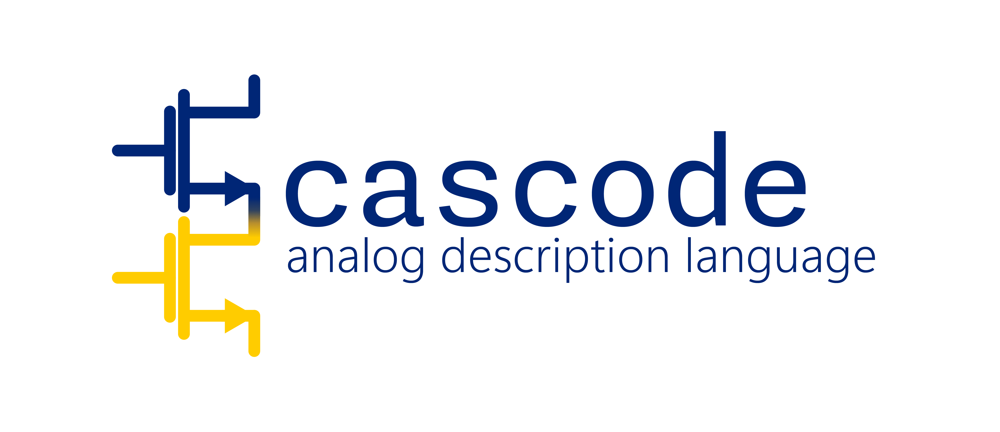

# cascode

<picture>
  <source media="(prefers-color-scheme: dark)" srcset="spec/logos/cascode_banner_dark.png">
  
</picture>

*Computer-Aided Synthesis Code for analog & mixed-signal design.*

**cascode** is a concise, object-oriented language for specifying **what** an analog system must do (specs, environment) and **how** it may be built (structural motifs), with an integrated synthesis workflow that turns `.cas` into a canonical IR (`.cir`) and a verified SPICE netlist.

It's designed to be **engineer-friendly** (reads like a schematic), **LLM-friendly** (classes, interfaces, and clear verbs), and **tool-friendly** (typed units, canonical IR, contracts).


## Language Specification
- [Chapter 1 – Introduction](spec/language-spec/Ch01_Introduction.md)
- [Chapter 2 – Core Concepts](spec/language-spec/Ch02_Core_Concepts.md)
- [Chapter 3 – CasIR: The Intermediate Representation](spec/language-spec/Ch03_CasIR.md)


## 🚀 Install

- npm (prebuilt binaries, zero .NET runtime required)

  ```sh
  npm install -g @cascode/cascode-cli
  ```

  Notes: The npm wrapper downloads a self-contained `cascode` binary for your
  platform from GitHub Releases. If your network blocks GitHub, set
  `CASCODE_DOWNLOAD_BASE` to a mirror and reinstall.

- .NET global tool (requires .NET 8 SDK)

  ```sh
  dotnet tool install -g Cascode.Cli
  ```

- Standalone release (download and add to PATH)

  Download the archive matching your OS/arch (e.g., `cascode-linux-x64.tar.gz`)
  from the Releases page, extract, and place `cascode` on your PATH.

After install, verify:

```sh
cascode --version
cascode --help
```

### Latest vs pre-release

- Stable (latest):
  - npm: `npm install -g @cascode/cascode-cli`
  - dotnet tool: `dotnet tool install -g Cascode.Cli`

- Pre-release (release candidates, nightly tags):
  - npm: `npm install -g @cascode/cascode-cli@next` (or pin a specific tag, e.g. `@0.2.0-rc.1`)
  - dotnet tool: `dotnet tool install -g Cascode.Cli --version 0.2.0-rc.1`
  - Direct download: grab the matching asset from the GitHub release marked “Pre-release”.

---

## 💡 Why cascode?

* **Bridges behavior and structure.** Mix spec-only requests ("meet GBW/PM/gain") with structural guidance ("choose from {tele-cascode, folded-cascode}").
* **Motif-centric.** Build with well-named blocks: `DiffPairNMOS`, `PMOSCascodeLoad`, `MillerRz`, `StrongArmLatch`, etc.
* **Concise structural sugar.** One-liners for mirrors, feedback, symmetry, and topology attachments: `mirror`, `fb`, `pair`, `attach`.
* **Synthesis built-in.** `slot` + `synth` select and size topologies from libraries characterized with SPICE.
* **Typed units and contracts.** Units like `1.2V`, `2pF`, `100MHz` are first-class; contracts (`req`/`ens`) capture headroom and validity.
* **CasIR.** A canonical typed graph that downstream tools and LLMs can reason about far better than raw SPICE.

---

## 📝 Language at a Glance

### Spec-only amplifier (you pick the topology)

```cas
package analog.amp; import lib.ota.*;

class AmpAuto implements Amplifier {
  supply VDD = 1.2V; ground GND;
  port in_p vip, in_n vin; port out vout;
  param CL = 2pF;

  env  { icmr in [0.55V..0.75V]; load C = CL; }
  spec { gbw>=100MHz; pm>=60deg; gain>=70dB; swing(vout) in [0.2V..1.0V]; power<=1mW; }

  slot Core : AmplifierStage;      // choose a core
  slot Comp : Compensator?;        // optional compensation

  synth {
    from lib.ota.*;                // search space
    fill Core, Comp;               // decide these slots
    prefer inputPolarity = NMOS;
    objective minimize power + 0.2*area;
  }

  bench { AC_OpenLoop; UnityUGF; Step; NoiseIn; }
}
```

### Guided selection (whitelist topologies)

```cas
class AmpGuided implements Amplifier {
  supply VDD=1.2V; ground GND;
  port in_p vip, in_n vin; port out vout; param CL=3pF;

  env  { load C=CL; icmr in [0.5V..0.8V]; }
  spec { gbw>=120MHz; pm>=60deg; gain>=72dB; power<=1mW; }

  slot Core : AmplifierStage; slot Comp : Compensator?;

  synth {
    from lib.ota.*;
    allow Core in { TeleCascodeNMOS, FoldedCascodePMOS };
    prefer Comp in { MillerRC, MillerRz };
    forbid GainBoosting;
    objective minimize power;
  }
}
```

### Structural 5T OTA (concise)

```cas
package analog.ota; import lib.motifs.*;

class OTA5T implements Amplifier {
  supply VDD=1.8V; ground GND;
  port in_p vinp, in_n vinn; port out vout; bias vbias_n;

  use {
    dp = new DiffPairNMOS(vinp, vinn) { gnd=GND; tail=vbias_n; };
    attach FiveTLoadPMOS on dp { vdd=VDD; out=vout; };  // diode+mirror load in 1 line
    C(vout, GND, 1pF);
  }

  spec { gbw>=50MHz; gain>=55dB; pm>=60deg; swing(vout) in [0.2V..1.6V]; power<=2mW; }
  bench { AC_OpenLoop; UnityUGF; Step; }
}
```

### Structural 5T OTA (explicit mirrors)

```cas
use {
  dp = new DiffPairNMOS(vinp, vinn) { gnd=GND; tail=vbias_n; };

  pm = mirror.PMOS(sense=dp.out_l, vdd=VDD,
                   taps={ n2:1, nmir:2, vout:2 });   // auto diode at sense
  nm = mirror.NMOS(sense=pm.nmir, gnd=GND, taps={ vout:1 }); // auto diode at sense

  C(vout, GND, 1pF);
}
```

#### SPICE wrap as a reusable "lego" (wide-swing mirror)

```cas
motif WideSwingPMOSMirror implements CurrentMirror {
  ports { sense, out: electrical; vdd: supply; }
  params { m:int=1; Wp=2u; Lp=0.18u; }

  wrap spice """
    .subckt WS_PMOS_MIRROR sense out vdd m=1 Wp=2u Lp=0.18u
    M1 out  sense vdd vdd pch W={Wp*m} L={Lp}
    M2 sense sense vdd vdd pch W={Wp}   L={Lp}   ; diode
    .ends
  """ map { sense=sense; out=out; vdd=vdd; }
}
```

#### Self-biased inverter OTA / TIA (feedback sugar)

```cas
class InverterOTA implements Amplifier {
  supply VDD=1.2V; ground GND; port in vin; port out vout;

  use {
    inv = new InverterGm(vdd=VDD, gnd=GND);
    inv.in <- vin; inv.out -> vout;
    fb R(vout -> vin, 20MOhm) { type=Auto; }  // MOS pseudo-res if needed
    C(vout, GND, 0.5pF);
  }

  spec { gbw>=50MHz; pm>=60deg; gain>=35dB; power<=500uW; }
}
```

### Strong-arm latch (clocked comparator)

```cas
class SALatch implements Comparator {
  supply VDD=1.2V; ground GND; port in_p vip, in_n vin; diff out(vop, von); clk phi;

  use { sa = new StrongArmLatch(vip, vin, phi, vop, von) { vdd=VDD; gnd=GND; }; }

  spec { decision_time(phi@posedge, DeltaVin=5mV) <= 300ps; offset <= 2mV; kickback_in <= 30mV; power <= 1mW; }
  bench { LatchDecision; OffsetMC; Kickback; }
  phase { phi: 500MHz, duty=50%, t_rise<=50ps; }
}
```

### System-level sense chain (spec-first pipeline)

```cas
class SenseChainAuto {
  supply VDD=1.2V; ground GND; port in vin; port out vout;

  env {
    source { Z=10Ohm; range=[0V..1V]; }
    load   { C=5pF; }
  }

  spec {
    gain == 40dB +/- 1dB over [10kHz..2MHz];
    in_noise <= 20nV/sqrtHz at 100kHz;
    settle(out, 1% step(0->1V)) <= 1us;
    power <= 10mW;
  }

  slot FrontEnd : FrontEndBlock;
  slot Filter   : BasebandFilter?;
  slot VGA      : VariableGainAmp?;
  slot Driver   : OutputDriver;

  synth {
    from lib.sense.*, lib.filters.*, lib.buffers.*;
    fill FrontEnd, Filter, VGA, Driver;
    prefer FrontEnd in { InverterTIA, OTA_TIA };
    objective minimize power;
  }

  bench { ChainAC; ChainNoise; Step; }
}
```

---

## ⚙️ From `.cas` to `.cir` to SPICE -- The Synthesis/Verification Flow

1. **Parse & Normalize**

   * Read `.cas`, resolve packages, check units and types, expand sugar (`pair`, `mirror`, `fb`).
   * Canonicalize specs and environment into inequalities.

2. **Lower to CasIR (`.cir`)**

   * Emit a **typed graph**: nets, ports, motif instances, edges, roles, constraints, benches, provenance.

3. **Feasibility Guards** (fast checks)

   * Headroom stacks, ICMR, GBW vs. power, PM (two-stage guards), device/legal limits.

4. **Topology Selection (if `synth {}` present)**

   * Build the **search space** from libraries (`Synthesizable` motifs/modules with `char {}` manifests).
   * **SAT** for structure + **SMT/OMT** for mixed Boolean/real feasibility and objectives (`allow/forbid/prefer/objective`).

5. **Sizing Initialization**

   * gm/Id + LUT-backed fits (convex/GP where possible) to determine $V_{ov}$, currents, $W/L$, compensation values.

6. **SPICE-Level Verification**

   * Auto-generate benches (AC/Noise/Tran, PSS/PNOISE when relevant).
   * Run across PVT and a limited MC budget; aggregate metrics and margins.

7. **Optimization Loop**

   * If misses, run sizing optimization (GP, adjoint-based gradients, or derivative-free).
   * If still infeasible, perform **minimal topological edits** within the chosen family; else re-select topology (bounded).

8. **Artifacts & Reports**

   * Outputs: `.cir` (CasIR), synthesized SPICE netlist(s), bench results, constraints/margins report, and provenance (which library blocks, parameters, and fits were used).

> **Why CasIR?** It's compact, unambiguous, and far easier for downstream tools to analyze than raw SPICE. It preserves intent (roles, traits, benches) and provenance.

**CasIR snippet (for `OTA5T`)**:

```json
{
  "nets":[{"id":"VDD","type":"supply"},{"id":"GND","type":"supply"},
          {"id":"vinp"},{"id":"vinn"},{"id":"nL"},{"id":"nR"},{"id":"vout"}],
  "motifs":[
    {"id":"dp","type":"DiffPairNMOS",
     "ports":{"in_p":"vinp","in_n":"vinn","out_l":"nL","out_r":"nR","tail":"vbias_n","gnd":"GND"}},
    {"id":"m5t","type":"FiveTLoadPMOS","ports":{"target":"dp","out":"vout","vdd":"VDD"}},
    {"id":"cl","type":"Cap","ports":{"p":"vout","n":"GND"}, "params":{"C":1e-12}}
  ],
  "constraints":{
    "numeric":["GBW>=5.0e7","PM>=60deg","Gain_dB>=55","Power<=2e-3",
               "Swing(vout) in [0.2,1.6]"]
  },
  "benches":["AC_OpenLoop","UnityUGF","Step"],
  "provenance":{"source":"examples/OTA5T.cas"}
}
```

---

## 📁 Repository Layout
```
cascode/
├─ README.md
├─ LICENSE
├─ spec/
│  └─ language-spec/
│     ├─ Ch01_Introduction.md
│     ├─ Ch02_Core_Concepts.md
│     ├─ Ch03_CasIR.md                 
│     └─ Grammar.ebnf                  
├─ spec/casir-schema/                  # JSON Schema for CasIR 
│  ├─ casir-json-1.schema.json         # root schema 
│  └─ casir-json-1-el.schema.json      # EL overlay 
├─ lib/
│  ├─ motifs/               # standard motif library (types + SPICE templates)
│  ├─ traits/
│  ├─ patterns/
│  └─ tech/                 # tech adapters, gm/Id LUTs, fitted models (stubs)
├─ tools/
│  ├─ cli/                  # `cascode` CLI (synth | verify | run | fmt)
│  ├─ parser/               # ANTLR grammar + generated C# parser glue
│  ├─ compiler/             # ADL to CasIR front end 
│  ├─ synthesis/            # topology selection, sizing, optimization
│  ├─ backends/
│  │  └─ spice/             # SPICE netlist writer + bench emitters
│  └─ casir/                # IR types, canonical JSON writer, schema validation
├─ examples/
│  ├─ AmpAuto.cas
│  ├─ AmpGuided.cas
│  ├─ OTA5T.cas
│  ├─ OTATelescopic.cas
│  ├─ InverterOTA.cas
│  ├─ InverterTIA.cas
│  ├─ SALatch.cas
│  └─ SenseChainAuto.cas
├─ tests/
│  ├─ fixtures/
│  │  └─ adl/                # source `.cas` inputs used by tests
│  ├─ golden/
│  │  ├─ ir/                 # canonical `.cir.json` snapshots (HL/ML/EL)
│  │  └─ spice/              # tiny golden netlists (smoke tests)
│  └─ conformance/           # parser/semantics cases, negative tests
└─ docs/
   ├─ getting-started.md
   └─ benchmarks/AMSGENBench.md
```

### Component Responsibilities
- `tools/parser`: Hosts `Cascode.g4` (ANTLR v4) and parser setup for C#.
- `tools/compiler`: Front end that turns ADL into CasIR (name/units/type checks, trait conformance, desugaring of attach/pair/mirror/fb, IR build with provenance).
- `tools/casir`: CasIR object model, canonical JSON writer (sorted keys/ids, explicit units), and JSON Schema validation.
- `tools/synthesis`: Slot fill, topology selection, sizing/optimization, and updating CasIR params (connectivity remains in `ports`).
- `tools/backends/spice`: Netlist writers per simulator and bench emitters driven by CasIR `constraints.measure` and `harness`.

### Notes
- Build artifacts go in `build/` (not committed). Generated ANTLR sources are excluded from VCS.
- CasIR on disk is JSON only; YAML is not used. Canonical writer ensures stable diffs.
- JSON Schema lives under `spec/language-spec/schema/` and is the contract for `.cir.json` files.

---

## 💻 CLI (preview)

```bash
# Synthesize topology and emit CasIR
cascode synth examples/AmpAuto.cas -o build/AmpAuto.cir

# Verify with SPICE + benches (tool selection and PDK binding vary by setup)
cascode verify build/AmpAuto.cir --spice spectre --pdk gpdk045

# End-to-end (synth + size + verify + report)
cascode run examples/AmpGuided.cas --pdk gpdk045 --out build/
```

---

## 🤝 Contributing

* See `CONTRIBUTING.md` for coding standards, style, and the language conformance suite.
* Library authors: include a `char { ... }` block with benches, PVT grid, sweeps, and fitted models.
* Please add minimal, runnable examples with each new motif or trait.

---

## 📄 License

BSD-3
