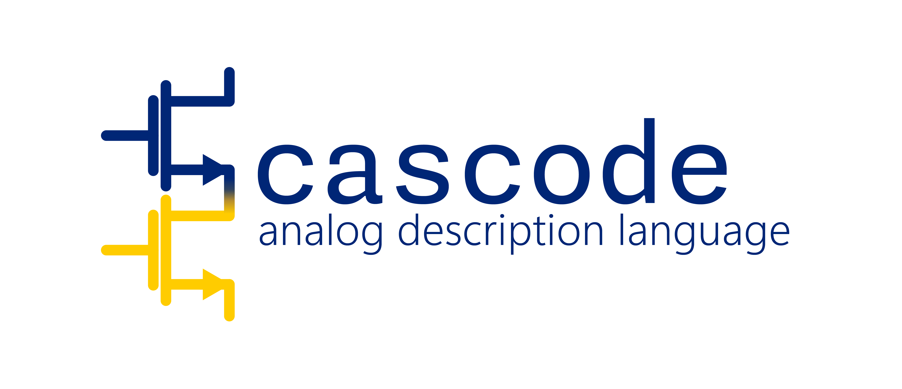

# cascode

<picture>
  <source media="(prefers-color-scheme: dark)" srcset="spec/logos/cascode_banner_dark.png">
  
</picture>


*Synthesized analog description language for rapid, portable analog/mixed-signal design*

**cascode** is a concise language for describing analog and mixed-signal circuits with explicit
connectivity, typed physical quantities, and a declarative bench system. The toolchain links `.cas`
source into self-contained `.cai` artifacts and emits simulator netlists plus bench runs for
constraint checking.

It's designed to be engineer-friendly (reads like a schematic), tool-friendly (typed quantities,
deterministic text formats), and reusable (benches bound through interfaces rather than rewritten per
topology).

## Getting Started

New to Cascode? Start here to understand the core concepts through a practical OTA example:

- **[Getting Started Guide](docs/GETTING_STARTED.md)**

## Language Specification

- [Spec overview](spec/language/README.md)
- [Chapter 1 – Introduction](spec/language/Ch01_Introduction.md)
- [Chapter 2 – Core Concepts](spec/language/Ch02_Core_Concepts.md)
- [Chapter 3 – Syntax Reference](spec/language/Ch03_Syntax_Reference.md)
- [Chapter 4 – Bench System](spec/language/Ch04_Bench_System.md)

Practical usage guide:
- `docs/language/README.md`
- `docs/language/style.md`
- `docs/language/bench-cookbook.md`
- `docs/language/connectors.md`
- `docs/language/troubleshooting.md`


## 🚀 Install

- npm (prebuilt binaries, zero .NET runtime required)

  ```sh
  npm install -g @cascode/cascode-cli
  ```

  Notes: The npm wrapper downloads a self-contained `cascode` binary for your
  platform from GitHub Releases. If your network blocks GitHub, set
  `CASCODE_DOWNLOAD_BASE` to a mirror and reinstall.

- .NET global tool (requires .NET 10 SDK)

  ```sh
  dotnet tool install -g Cascode.Cli
  ```

- Standalone release (download and add to PATH)

  Download the archive matching your OS/arch (e.g., `cascode-linux-x64.tar.gz`)
  from the Releases page, extract, and place `cascode` on your PATH.

After install, verify:

```sh
cascode --version
cascode --help
```

Install ngspice for bench execution:

```sh
cascode install ngspice
```

`cascode install ngspice` installs the prebuilt ngspice package from the same GitHub release tag
as your installed Cascode CLI version. If you need a local build instead, use:

```sh
cascode install ngspice --from-source
```

### Latest vs pre-release

- Stable (latest):
  - npm: `npm install -g @cascode/cascode-cli`
  - dotnet tool: `dotnet tool install -g Cascode.Cli`

- Pre-release (release candidates, nightly tags):
  - npm: `npm install -g @cascode/cascode-cli@next` (or pin a specific tag, e.g. `@0.5.1-rc.1`)
  - dotnet tool: `dotnet tool install -g Cascode.Cli --version 0.5.1-rc.1`
  - Direct download: grab the matching asset from the GitHub release marked "Pre-release".

---

## 💡 Why cascode?

* **Unified, deterministic artifacts.** Link `.cas` into `.cai` (self-contained, diff-friendly).
* **Explicit connectivity.** `--` wiring and `.Terminal--Net` bindings; no implicit connect-by-name.
* **Typed quantities.** Literals like `1.8V`, `50Ohm`, `15pF`, `60deg`, `40dB` are first-class.
* **Declarative benches.** Define `bench` once, bind through interfaces, constrain via `binding::Measurement`.
* **Tooling.** `cascode link`, `emit`, `bench run`, `verify`, `erc`, `render`, plus PDK workspace tools.

---

## 📝 Language at a Glance

Cascode is a unified language: circuits, benches, and primitives share a single syntax. A small,
self-contained example (from `tests/golden/cas/bench/RcLowpass.el.cai`) looks like this:

```cascode
VERSION 4.0

primitive Resistor ResistorIdeal(size primSize) {
  device "resistor"
  params { R = primSize.R }
}

primitive Capacitor CapacitorIdeal(size primSize) {
  device "capacitor"
  params { C = primSize.C }
}

bench DiffToSELowpass {
  stim IN : Diff
  resp OUT : analog

  fill {
    net g0 : ground
    GND g = new GND() { .GND--g0 }
    VAC vp = new VAC(A=1, phase=0deg) { .P--IN.P, .N--g0 }
    IN.N--g0
  }

  analysis {
    ACAnalysis ac = new ACAnalysis(space=Log, samples=200, start=1Hz, stop=1GHz)
  }

  measurements {
    measurement LowpassBandwidth : Hz {
      TransferFunction H = transfer(ac, IN, OUT)
      GainSpectrum G = db20(H.Mag())
      return G.FindCrossing(-3dB, dir=falling, cross=1, from=ac.start, to=ac.stop)
    }
  }
}

circuit RcLowpass {
  level EL
  input IN : Diff
  output OUT : analog
  ground GND

  fill {
    Resistor R1 = new ResistorIdeal(size(R=1k)) { .P--IN.P, .N--OUT }
    Capacitor C1 = new CapacitorIdeal(size(C=1p)) { .P--OUT, .N--GND }
  }

  benches {
    bind DiffToSELowpass as lp {
      bench.IN--dut.IN
      bench.OUT--dut.OUT
      dut.GND--g0
    }
  }

  constraints {
    numeric { c_fc = lp::LowpassBandwidth >= 50MHz }
  }
}
```

---

## ⚙️ From `.cas` to `.cai` to SPICE

1. `cascode link` resolves `include` directives and writes `.cai` output.
2. `cascode emit` emits simulator netlists from EL circuits (source `.cas` or linked `.cai`).
3. `cascode bench run` runs constraint-selected benches and writes `results.json` plus per-bench traces.
4. `cascode verify` checks numeric constraints against results.

Optional tooling:

- `cascode erc` runs electrical rule checks.
- `cascode render` renders an SVG schematic from an EL circuit.

Roadmap stages (vision):

- `cascode syn` consumes `.hl/.ml.cai` plus `<name>.synth.yaml` and produces `.el.cai` (topology selection and sizing).
- `cascode par` consumes `.el.cai` and produces physical layout artifacts; `.cal` is reserved for Cascode Layout files (format specified separately).

---

## 📁 Repository Layout
```
cascode/
├─ README.md
├─ spec/
│  └─ language/
│     ├─ Ch01_Introduction.md
│     ├─ Ch02_Core_Concepts.md
│     ├─ Ch03_Syntax_Reference.md
│     └─ Ch04_Bench_System.md
├─ lib/
│  └─ std/
│     ├─ prim/                 # Primitive definitions + connector interfaces
│     ├─ bench/                # Standard bench definitions (declarative)
│     ├─ amp/                  # Amplifier interfaces and circuits
│     ├─ composites/           # Multi-block composites
│     └─ refs/                 # Reference circuits (current/voltage references)
├─ tools/
│  ├─ cli/
│  ├─ language/
│  ├─ bench/
│  ├─ workspace/
│  └─ render/
├─ tests/
│  ├─ golden/              # Canonical Cascode fixtures and results (see below)
│  ├─ integration/
│  └─ unit/
├─ editors/
│  └─ vscode/
└─ examples/
   └─ harnesses/
```

### Component Responsibilities

- `tools/cli`: CLI entrypoints and UX (no core semantics).
- `tools/language`: Grammar, parsing, linking, validation, and IR for the Cascode language.
- `tools/bench`: Bench planning/runtime and bench-oriented SPICE emission support.
- `tools/workspace`: PDK workspace scanning and persistence (`pdk.db`).
- `tools/render`: Schematic/layout rendering from EL circuits.

### Notes

- Build artifacts go in `build/` (not committed).
- Linked Cascode (`.cai`) is line-oriented text with explicit units and deterministic ordering.

---

## 🧪 Quick Start (build & test)

### Building from source

```bash
# Build everything (compiler, CLI, tests)
dotnet build

# Run the CLI directly
dotnet run --project tools/cli/Cascode.Cli.csproj
```

### Install as a global tool (for development)

If you want to build the repo and install it as a global tool on your shell (so you can run `cascode` directly from anywhere):

```bash
scripts/install-dev-tool.sh
```

This script will:
1. Pack the CLI project into a NuGet library
2. Uninstall any existing global installation of `Cascode.Cli`
3. Install the newly built version as a global .NET tool

After installation, ensure `~/.dotnet/tools` is on your PATH, then verify:

```bash
cascode --version
```

### Git hooks

Install [pre-commit](https://pre-commit.com/) and enable the repo's hooks:

```bash
pre-commit install
```

This runs CSharpier on staged C# files before each commit, matching the CI format check.

## ♻️ Golden fixtures

`tests/golden/` is the canonical store for regression assets that tie Cascode
inputs (`*.cai`) to expected emitted outputs and constraint-checking results.

---

## 💻 CLI (preview)

> Architecture, command modules, and snapshot testing workflow are documented in [tools/README.md](tools/README.md).

```bash
# Link source (resolve includes) to self-contained .cai (default mode)
cascode link tests/golden/cas/stress/OTA5T_Sky130.cas -o build

# Link in include-pruned bench mode (preserve bench bindings, omit bench definitions, keep a minimal include set)
cascode link tests/golden/cas/stress/OTA5T_Sky130.cas -o build --no-link-benches

# Emit simulator netlists from an EL circuit (source .cas or linked .cai)
cascode emit tests/golden/cas/bench/RcLowpass.el.cai --backend ngspice --out build/rc-emit

# Run benches and write consolidated results plus a per-point trace for each bench.
# If a bench name is omitted, all benches declared by the circuit are executed.
cascode bench run tests/golden/cas/bench/RcLowpass.el.cai -o build/rc-run --backend ngspice

# Verify constraints from either results.json or trace.jsonl
cascode verify tests/golden/cas/bench/RcLowpass.el.cai build/rc-run/results.json
```

---

## 🎨 Editor Support

Syntax highlighting for `.cas` files is available for VS Code, Cursor, and other editors:

```bash
# Install for VS Code / Cursor / VSCodium (macOS/Linux)
cd editors/vscode && ./install.sh

# Windows (PowerShell)
cd editors\vscode; .\install.ps1
```

Highlights keywords (`circuit`, `interface`, `bench`, `fill`, `constraints`, `harness`), typed quantities (`1.8V`, `15pF`, `50MHz`), the wire operator (`--`), and more. See [editors/README.md](editors/README.md) for details and GitHub Linguist integration.

For native editor/runtime integrations, see `@cascode/native` in `editors/node`:

- Package docs: `editors/node/README.md`
- Runtime package: `editors/node/package.json`
- Platform package templates: `editors/node/platform-packages/`

Maintainers: native npm package versions are release-tag aligned and validated in `.github/workflows/release.yml`.

---

## 🤝 Contributing

* See `CONTRIBUTING.md` for coding standards, style, and the language conformance suite.
* Library authors: add minimal, runnable examples with each new circuit or interface.

---

## 📄 License

BSD-3-Clause
