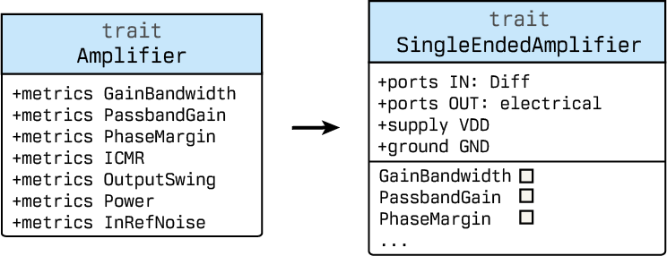
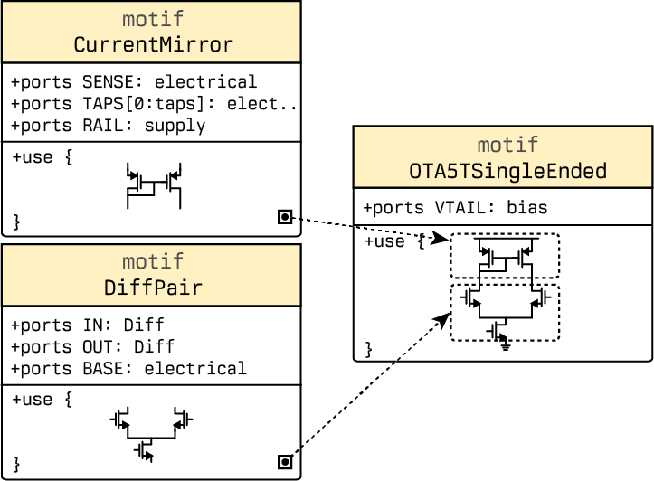
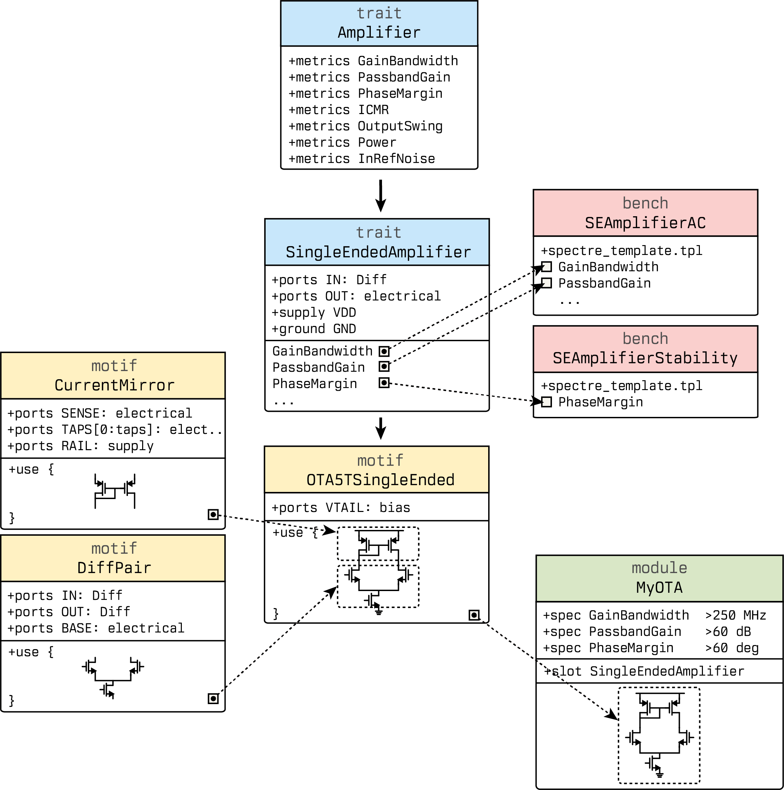

# Getting Started with Cascode

This guide introduces the core concepts of Cascode through a practical example: designing a 5-transistor operational transconductance amplifier (OTA).

## Core Language Constructs

Cascode organizes analog design around a few primary language constructs: traits, motifs, modules, and benches.

A **trait** defines a behavioral contract. It specifies what ports a circuit exposes, what metrics it produces, and how those metrics map to concrete measurements. Traits can inherit from other traits, so we can build a taxonomy of circuit behaviors. An `Amplifier` trait, for instance, declares canonical metrics like gain-bandwidth and phase margin without prescribing any specific topology. A trait is analogous to an interface in object-oriented programming; it establishes expectations but carries no implementation.



A **motif** is a reusable structural building block. It is an entry in the topology selection catalog. It implements one or more traits by answering questions about circuit topology: which subcircuits to instantiate, how to connect them, and what design parameters to expose.

Motifs compose. What I mean is, a `DiffPair` motif can be instantiated within an `OTA5TSingleEnded` motif, which itself can be used in a two-stage amplifier. Because a motif declares which traits it implements, the type system can verify at design-time that all required ports and metrics are present.

Very importantly, motifs contain no performance specifications. They describe structure, not requirements.



A **module** represents a complete design unit. It instantiates motifs, binds their free parameters, and attaches quantitative performance targets. A module declaration might state that gain-bandwidth must exceed 250 MHz or that phase margin must stay above 60 degrees. These specifications drive synthesis and optimization. Unlike a motif, which defines a reusable pattern, a module defines a concrete design instance with measurable goals.

A **bench** defines a simulation-based measurement. It specifies which SPICE netlist template to instantiate, what analyses to run, and what scalar quantities to extract. Traits bind their abstract metrics to concrete testbench outputs.

These constructs separate concerns that traditionally entangle in analog design flows. The trait system lets you reason about circuit behavior independently of topology. The motif library accumulates structural knowledge without embedding specific performance targets. The module layer states requirements without prescribing implementations. The bench layer handles the mechanical work of simulation setup and postprocessing.

## Example: Building a 5T OTA

Let's examine how a 5-transistor OTA would be structurally constructed in Cascode ADL, so that it can be entered into the synthesis catalog as an eligible target for topology selection.

The `Amplifier` trait contributes the canonical performance metrics:

```java
package lib.std.amp;

trait Amplifier {
  metrics { 
    GainBandwidth;
    PassbandGain;
    PhaseMargin;
    ICMR;
    OutputSwing;
    Power;
    NoiseIn;
  }
}
```

The `SingleEndedAmplifier` trait extends that surface with the single-ended port definitions and bench bindings:

```java
package lib.std.amp;

trait SingleEndedAmplifier extend Amplifier {
  ports [ IN: Diff, OUT: analog ]
  supply VDD; ground GND;

  metrics {
    GainBandwidth from SEAmplifierACBench.GainBandwidth;
    PassbandGain  from SEAmplifierACBench.PassbandGain;
    PhaseMargin   from SEAmplifierACBench.PhaseMargin;
  }
}
```

This binding establishes how abstract performance requirements translate to concrete measurements. The bench itself defines what those measurements return:

```java
package lib.std.amp.benches;

bench SEAmplifierACBench {
  spectre_template = "SEAmplifierACBench.tpl";
  metrics [
    GainBandwidth: Hz,
    PassbandGain: dB,
    PhaseMargin: deg,
    LowpassBandwidth: Hz,
    HighpassBandwidth: Hz,
    BandpassBandwidth: Hz
  ]
}
```

Now the motif `OTA5TSingleEnded` can implement the contract while specifying only the topology:

```java
package analog.ota; 
import lib.std.amp.*; 
import lib.std.prim.*;

motif OTA5TSingleEnded implements SingleEndedAmplifier {
  supply VDD = 1.8V; ground GND;
  ports [ IN: Diff, OUT: analog, VTAIL: bias ]

  use {
    // Differential pair with internal tail
    dp = new DiffPair { p=NMOS; hasTail=true } {
      IN.P -> IN.P; IN.N -> IN.N; BASE -> GND; BIAS -> VTAIL;
    };

    // PMOS current mirror as active load
    cm = new CurrentMirror { p=PMOS; taps=1 };
    attach cm to dp;

    // Single-ended output from sensed branch
    connect dp.OUT.N -> OUT;
  }
}
```

Finally, a top-level module `MyOTA` instantiates the motif, binds its `VTAIL` to a synthesized bias rail, and attaches quantitative targets for gain, bandwidth, and stability:

```java
module MyOTA {
  ports [ IN: Diff, OUT: analog ]
  supply VDD = 1.8V; ground GND;

  spec {
    GainBandwidth >= 250MHz;
    PassbandGain >= 60dB;
    PhaseMargin >= 60deg;
    Power <= 1mW;
  }

  env {
    load C = 5pF;
    vdd = 1.8V;
    temp = 27C;
  }

  use {
    ota = new OTA5TSingleEnded { 
      IN -> IN; 
      OUT -> OUT; 
      VTAIL -> vbias;
    };
    
    // Bias generation would go here
    // ...
  }
}
```

What we have constructed is captured in the diagram below.



## What We've Accomplished

This example demonstrates the core separation of concerns in Cascode. Behavioral specification (`Amplifier` trait) is independent of interface details. Interface contracts (`SingleEndedAmplifier`) connect behavior to measurement. Structural implementation (`OTA5TSingleEnded` motif) is topology-only. Performance requirements (`MyOTA` module) drive synthesis without prescribing topology. Measurements (benches) are reusable across different implementations.

During synthesis, the toolchain can validate that the motif provides all required ports and metrics, size the transistors to meet the specifications, consider alternative motifs that implement the same trait, and verify performance through the mapped benches
