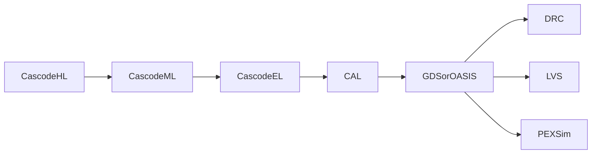
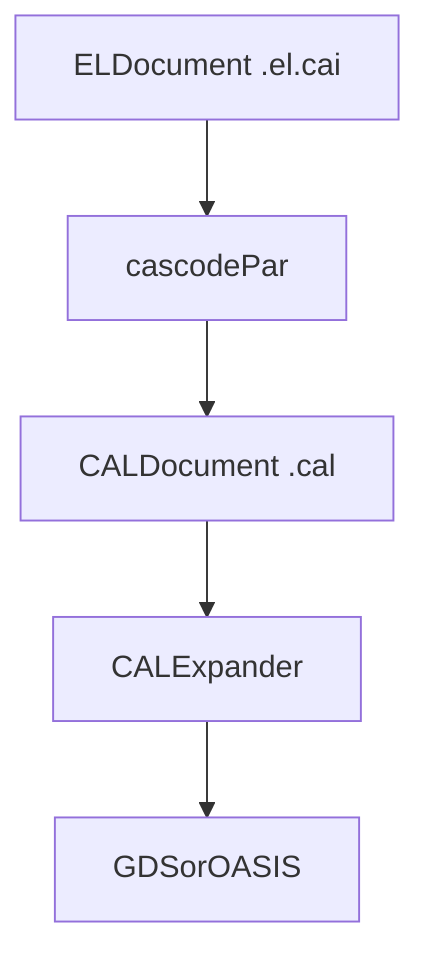
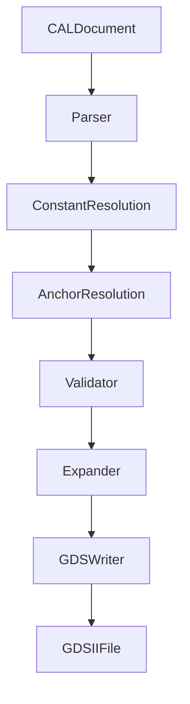
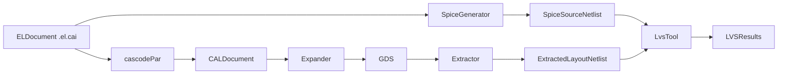

# RFC: CAL (Cascode Layout) Specification

| Field | Value |
|-------|-------|
| RFC Number | 0001 |
| Title | CAL: Cascode Layout Assembly Language |
| Author | Daniel Lovell |
| Status | Draft |
| Created | 2026-01-25 |
| Target Version | CAL 1.0 |
| Supersedes | None |

---

## Abstract

This RFC defines CAL (Cascode Layout), a language for specifying integrated circuit layout geometry. CAL provides a thin abstraction over GDS-II/OASIS that enables: (1) deterministic generation of manufacturing-ready layout data, (2) traceability from physical geometry to source EL Cascode circuits (`.el.cai`), (3) human-readable representation of layout decisions, and (4) maintainable layout descriptions through relative positioning and structured grouping.

CAL provides primitive geometric operations (P-cell placement, rectangles, paths, and vias), augmented with anchor-based relative positioning, hierarchical grouping constructs, and explicit net attribution. This design maximizes expressiveness while maintaining a direct correspondence to physical output formats.

---

## 1. Motivation

### 1.1 Problem Statement

Analog integrated circuit layout requires translating an electrical netlist into physical geometry that:

1. Implements the correct connectivity (verified by LVS)
2. Satisfies manufacturing design rules (verified by DRC)
3. Meets performance specifications (verified by post-layout simulation)
4. Achieves yield targets (requires matching, symmetry, isolation)

Current layout representations fall into two categories:

Physical formats (GDS-II, OASIS): These are manufacturing output formats optimized for data density, not human readability or design intent. They use integer database units, lack semantic information, and cannot express traceability to source designs.

Constraint-based formats: These express layout intent (symmetry groups, matching requirements) but not actual geometry. They require a separate constraint solver and do not represent committed layout decisions.

Neither category provides a human-readable, semantically rich representation of actual layout geometry that maintains traceability to the source netlist while supporting practical design iteration.

### 1.2 Goals

CAL is designed to:

1. Provide complete geometric specification. Every construct expands deterministically to GDS-II/OASIS primitives. Given a CAL document and the PDK workspace database (`pdk.db`), the output is bit-identical across runs.

2. Maintain traceability. Every geometric element traces to a Cascode EL device or net (or is explicitly marked as layout-only), enabling debugging, verification, and design review.

3. Support practical iteration. Anchor-based relative positioning enables local changes without global coordinate recalculation. Constants and expressions reduce repetition and enable single-point-of-change modifications.

4. Enable human review. An engineer can read CAL and understand what geometry will be generated without executing expansion tools or opening a layout viewer.

5. Produce manufacturing-ready output. Emit GDS-II or OASIS files suitable for foundry submission.

6. Scale to complex designs. Grouping constructs, parameterization, and repetition mechanisms support designs with hundreds or thousands of devices.

### 1.3 Non-Goals

CAL explicitly does not:

1. Encode layout patterns. Common-centroid, interdigitation, guard rings, and other analog layout techniques are not language constructs. CAL expresses their geometric realization; the layout engine decides which patterns to apply.

2. Provide constraint satisfaction. CAL describes geometry, not constraints. Constraints live in EL Cascode circuits or external specifications.

3. Abstract routing infrastructure. Track-based routing, pin access grids, and routing channels are not language constructs. CAL draws paths at explicit (absolute or relative) coordinates.

4. Guarantee DRC cleanliness. CAL can express DRC-violating geometry. Verification is performed externally.

5. Prescribe layout methodology. The language is agnostic to how layout decisions are made, whether by human designers, automated tools, or any other means.

6. Provide PDK portability. A CAL document is specific to one PDK. The layout engine that generates CAL may be portable, but the output is PDK-specific due to P-cell geometries and layer mappings.

### 1.4 Design Principles

Explicit geometry: Coordinates, dimensions, and layers are stated explicitly. There are no implicit defaults that affect physical output.

Relative positioning: Anchor references enable coordinates relative to placed devices, supporting local reasoning and maintainable layouts.

Deterministic expansion: Given a CAL document and the PDK workspace database (`pdk.db`), the output GDS is bit-identical across implementations and runs.

Structured organization: Groups organize related geometry (device fingers, matched pairs, layout-only structures) with explicit semantic annotations.

Traceability preservation: Device identifiers and net attributions link CAL geometry to Cascode EL devices and nets, enabling LVS correspondence and design debugging.

Extensibility: Attribute annotations support tool-specific metadata without language changes.

---

## 2. System Architecture

### 2.1 Position in the Cascode Toolchain



CAL sits after electrical elaboration. `cascode par` consumes EL circuit artifacts (`.el.cai`) and produces layout descriptions in `.cal`. A CAL expander then resolves anchors and PDK catalog references from `pdk.db` to generate manufacturing formats (GDS-II/OASIS).

### 2.2 Data Flow



The data flow is intentionally staged: EL connectivity enters the layout engine, committed geometry is captured in CAL, and expansion is a deterministic, replayable step that yields final physical output.

Maintained D2 sources for these diagrams live under `docs/rfcs/resources/0001/*.d2`.

### 2.3 PDK Workspace Database (`pdk.db`)

CAL references PDK constructs (layers, vias, cells, and P-cells) by PDK-defined names. The PDK workspace database (`pdk.db`) provides the mapping to physical data:

| Component | Description | Example |
|-----------|-------------|---------|
| Layer map | (layer name, purpose) -> GDS layer/datatype | `<layer>.drawing` -> `<layer>/<datatype>` |
| P-cell library | Parameterized device generators | `nfet_01v8(W, L, NF)` |
| P-cell anchors | Named points on P-cell geometry | `drain`, `gate`, `source` |
| Via definitions | Via cut geometry and enclosures | `M1M2_C: cut=via, size=0.15u` |
| Database unit | Physical size of one GDS unit | `1nm` |
| Manufacturing grid | Minimum coordinate resolution | `5nm` |

The `pdk.db` is generated by `pdk scan` for a specific workspace root. CAL documents are specific to a particular PDK and PDK version; the expander validates that the database provenance matches the document header.

### 2.4 Relationship to Cascode EL

CAL implements a Cascode EL (`.el.cai`) circuit netlist. The relationship is verified by LVS:

| Cascode EL Construct | CAL Realization |
|-------------------|---------------------|
| `circuit`/`fill` device instances | `place` statements and `group ... : fingers` whose widths match EL intent |
| Net declarations and connectivity | Routing geometry (`path`, `rect`, `via`) with `[net_name]` attribution |
| Terminals (including bundle fields) | `port` statements at the cell boundary (for example `IN.P`, `IN.N`) |
| Supply/ground terminals | Power ports and corresponding power routing geometry |

---

## 3. Language Specification

### 3.1 Lexical Structure

#### 3.1.1 Character Encoding

CAL files use UTF-8 encoding with LF (Unix-style) line endings. Files should not contain a byte-order mark (BOM).

#### 3.1.2 Comments

Line comments begin with `//` and extend to end of line:

```
// This is a comment
place M1 nfet_01v8 (W=1u, L=100n, NF=2) @ (5u, 10u) R0  // inline comment
```

Block comments are not supported. For multi-line commentary, use consecutive line comments.

#### 3.1.3 Whitespace

Whitespace (space, tab) separates tokens. Indentation is not significant but is encouraged for readability, especially within groups. Blank lines are permitted anywhere and are ignored.

#### 3.1.4 Identifiers

Identifiers follow the pattern `[A-Za-z_][A-Za-z0-9_]*`.

Hierarchical identifiers use dot notation for design hierarchy and group nesting: `dp.M_N`, `diffpair.M_N.f0`.

Anchor references use `@` to access named points on placed devices or explicit anchors: `M1@drain`, `M1@gate`, `input_tap`.

Bundle field identifiers use dot notation: `IN.P`, `IN.N`, `OUT.P`.

#### 3.1.5 Numeric Literals

Integer literals:
```
42
0
-17
```

Floating-point literals:
```
3.14
-0.5
1.23e-4
2.5e6
```

Physical quantities use SI prefixes appended directly to numbers:

| Prefix | Symbol | Factor |
|--------|--------|--------|
| tera | T | 10^12 |
| giga | G | 10^9 |
| mega | M | 10^6 |
| kilo | k | 10^3 |
| milli | m | 10^-3 |
| micro | u | 10^-6 |
| nano | n | 10^-9 |
| pico | p | 10^-12 |
| femto | f | 10^-15 |

Examples:
```
500n      // 500 nanometers = 500 * 10^-9 meters
1.2u      // 1.2 micrometers = 1.2 * 10^-6 meters
180n      // 180 nanometers
5u        // 5 micrometers
10k       // 10 kilohms (for resistor values)
1p        // 1 picofarad (for capacitor values)
```

All geometric coordinates and dimensions are in meters (with SI prefix). The expander converts to integer database units.

#### 3.1.6 Coordinates and Coordinate Expressions

Absolute coordinates are parenthesized pairs of physical quantities:

```
(5u, 10u)
(0, 0)
(1.5u, 2.3u)
(-500n, 100n)
```

Anchor references resolve to coordinates based on placed devices or explicit anchors:

```
M1@drain          // Center of M1's drain contact
M1@gate           // Center of M1's gate
M1@origin         // Placement origin of M1
M1@bbox.ll        // Lower-left of M1's bounding box
M1@bbox.ur        // Upper-right of M1's bounding box
input_tap         // User-defined anchor
```

Coordinate extraction accesses individual components:

```
M1@drain.x        // X coordinate of M1's drain
M1@drain.y        // Y coordinate of M1's drain
```

Relative coordinates use offset expressions:

```
M1@drain + (500n, 0)      // 500nm to the right of M1's drain
M1@origin + (pitch, 0)    // One pitch unit right of M1's origin
base + (i * pitch, 0)     // Computed offset using constant
```

Arithmetic expressions are permitted in coordinate contexts:

```
(base_x + 3 * pitch, 12u)
(M1@drain.x, M2@gate.y)           // Mixed: X from M1, Y from M2
(midpoint(M1@origin.x, M2@origin.x), 10u)  // Built-in function
```

The coordinate system origin (0, 0) is at the lower-left corner of the cell by convention. The X-axis increases rightward; the Y-axis increases upward. Negative coordinates are permitted.

#### 3.1.7 Orientations

Eight standard orientations specify placement transformation:

| Name | Description | Matrix |
|------|-------------|--------|
| `R0` | No transformation (identity) | [1,0; 0,1] |
| `R90` | 90 degrees counter-clockwise rotation | [0,-1; 1,0] |
| `R180` | 180 degrees rotation | [-1,0; 0,-1] |
| `R270` | 270 degrees counter-clockwise rotation | [0,1; -1,0] |
| `MX` | Mirror about X-axis | [1,0; 0,-1] |
| `MY` | Mirror about Y-axis | [-1,0; 0,1] |
| `MXR90` | Mirror X, then rotate 90 degrees CCW | [0,1; 1,0] |
| `MYR90` | Mirror Y, then rotate 90 degrees CCW | [0,-1; -1,0] |

Transformations are applied about the P-cell's defined origin before translation to the placement coordinate.

#### 3.1.8 Layer Names

Layer names are identifiers that map to GDS layer/datatype pairs via the PDK workspace database (`pdk.db`), which is derived from the PDK's layermap and technology sources.

```
// Typical layer names (PDK-specific)
diff, tap                       // diffusion
poly                            // polysilicon
nwell, pwell                    // wells
nplus, pplus                    // implants
li                              // local interconnect
<metal1>, <metal2>, ...         // metals (example naming varies by PDK)
<cut1>, <cut2>, ...             // cut layers (example naming varies by PDK)
```

Layer names are PDK-defined identifiers. The `pdk.db` layer catalog defines their physical GDS layer/datatype mapping, including purpose-qualified variants (e.g. `<layer>.pin`, `<layer>.label`, `<layer>.drawing`).

#### 3.1.9 Net Names

Net names in brackets attribute geometry to electrical nets:

```
[mirror_gate]     // Geometry belongs to net "mirror_gate"
[IN.P]            // Geometry belongs to bundle field IN.P
[VDD]             // Power net
[]                // Explicitly no net (layout-only geometry)
```

#### 3.1.10 Attributes

Attributes provide extensible metadata on statements:

```
[key=value, key2=value2]
[critical=true]
[lvs_ignore=true, purpose="dummy fill"]
[color=A]
```

Attribute values may be:
- Boolean: `true`, `false`
- String: `"quoted text"`
- Identifier: `A`, `shield_net`
- Number: `100`, `2.5`

#### 3.1.11 Reserved Words

The following words are reserved and must not be used as identifiers:

```
CAL, pdk, topcell, dbu, grid, emit
place, rect, path, via, port, label, anchor
cell, endcell, inst
group, endgroup
const
array, pitch, orient
repeat, in, if, then, else
R0, R90, R180, R270, MX, MY, MXR90, MYR90
flat, hierarchical
fingers, match, guard, shield
true, false
midpoint, min, max, abs
```

### 3.2 Document Structure

A CAL document consists of:

1. Header (required): Version, PDK, top cell name, optional settings
2. Constants (optional): Named values for reuse
3. Body (required): Geometry, groups, and hierarchy statements

```
CAL <version>
pdk <pdk_name> <pdk_version>
topcell <cell_name>
[dbu <unit>]
[grid <resolution>]
[emit flat|hierarchical]

[const <name> = <value>]
...

<statements>
```

#### 3.2.1 Version Declaration

```
CAL 1.0
```

Required. Specifies the CAL language version.

Version semantics:
- Major version changes (e.g., 1.x -> 2.0) indicate breaking changes. Readers must reject documents with incompatible major versions.
- Minor version changes (e.g., 1.0 -> 1.1) indicate backward-compatible additions. Readers must accept documents with the same major version.

#### 3.2.2 PDK Declaration

```
pdk sky130 1.0.45
```

Required. Specifies which PDK and PDK version to use for expansion.

The expander resolves this to the workspace's `pdk.db` produced by `pdk scan` and validates that the database's recorded PDK name/version match the document header. If the database cannot be found or the version is incompatible, expansion fails with an error.

Rationale: PDK version pinning ensures reproducible builds. P-cell geometry, layer numbers, and design rules may change between PDK versions.

#### 3.2.3 Top Cell Declaration

```
topcell OTA5TSingleEnded
```

Required. Names the top-level cell (GDS structure) in the output.

The top cell name must be a valid identifier. It becomes the `STRNAME` of the outermost structure in GDS output.

#### 3.2.4 Database Unit Declaration

```
dbu 1n
```

Optional. Overrides the PDK's default database unit.

Specifies the physical dimension of one GDS database unit. Common values:
- `1n` (1 nanometer) - typical for 65nm and older
- `500p` (0.5 nanometer) - typical for advanced nodes
- `100p` (0.1 nanometer) - high-precision applications

If omitted, the `pdk.db` default is used.

#### 3.2.5 Manufacturing Grid Declaration

```
grid 5n
```

Optional. Specifies coordinate quantization resolution.

All coordinates are rounded to the nearest multiple of this value before conversion to database units. If omitted, the `pdk.db` default is used.

Grid snapping formula:
```
snapped_value = round(value / grid) * grid
```

#### 3.2.6 Emit Mode Declaration

```
emit flat
emit hierarchical
```

Optional. Controls GDS output structure. Default is `hierarchical`.

- `hierarchical`: P-cells and sub-cells are emitted as separate GDS structures with SREF references. Results in smaller files and preserved hierarchy.
- `flat`: All geometry is expanded inline into the top cell. Required by some DRC/LVS tools.

#### 3.2.7 Constant Declarations

```
const finger_pitch = 520n
const finger_W = 500n
const finger_L = 180n
const dp_y = 12u
const metal_width = 200n
const n_fingers = 4
```

Optional. Defines named constants for use in coordinate expressions and parameter values.

Constants must be declared before use. Constants may reference previously-declared constants:

```
const base_pitch = 500n
const double_pitch = 2 * base_pitch
```

Constant values may be:
- Physical quantities: `520n`, `1.5u`
- Integers: `4`, `8`
- Expressions involving other constants: `base + offset`, `2 * pitch`

### 3.3 Statements

Statements define the layout geometry. Each statement occupies one or more logical lines.

#### 3.3.1 Place Statement

Instantiates a PDK P-cell (parameterized cell) at a specified location.

Syntax:
```
place <device_id> <pcell_name> (<param>=<value>, ...) @ <coord_expr> <orientation> [<attributes>]
```

Components:

| Component | Description |
|-----------|-------------|
| `device_id` | Identifier linking to a Cascode EL device or layout-only purpose |
| `pcell_name` | PDK P-cell name as defined in the workspace `pdk.db` layout catalog |
| `(<param>=<value>, ...)` | Comma-separated parameter assignments |
| `<coord_expr>` | Absolute coordinate, anchor reference, or relative expression |
| `orientation` | Transformation: `R0`, `R90`, `R180`, `R270`, `MX`, `MY`, `MXR90`, `MYR90` |
| `<attributes>` | Optional bracketed attributes |

Examples:

```
// Absolute positioning
place M1 nfet_01v8 (W=500n, L=180n, NF=1) @ (5u, 12u) R0

// Relative to another device
place M2 nfet_01v8 (W=500n, L=180n, NF=1) @ M1@origin + (pitch, 0) R0

// Using constants
place M3 nfet_01v8 (W=finger_W, L=finger_L, NF=1) @ (base_x, dp_y) MY

// With attributes
place M_dummy nfet_01v8 (W=500n, L=180n, NF=1) @ (4u, 12u) R0 [lvs_ignore=true]

// Multi-finger device (single P-cell with NF>1)
place M_TAIL nfet_01v8 (W=1u, L=180n, NF=4) @ (6u, 4u) R0
```

Semantics:

1. The expander validates that `pcell_name` exists in the `pdk.db` layout catalog.
2. Parameters are validated against the P-cell's parameter schema (types, ranges).
3. The coordinate expression is evaluated to an absolute coordinate.
4. The P-cell implementation referenced by `pdk.db` is invoked with the specified parameters.
5. The resulting geometry is transformed by `orientation` (rotation/mirror about P-cell origin).
6. The geometry is translated to the evaluated coordinate.
7. Anchors defined for the P-cell become available for reference as `device_id@anchor_name`.
8. The `device_id` is recorded for LVS correspondence (unless `lvs_ignore=true`).

P-cell width convention:

The `W` parameter specifies width per finger. For multi-finger devices (NF > 1), total device width is `W * NF`. This convention is fixed by CAL; the `pdk.db` catalog must normalize any PDK-specific conventions to this interpretation.

Common P-cell parameters:

| Parameter | Device Types | Description |
|-----------|--------------|-------------|
| `W` | Transistors | Channel width per finger |
| `L` | Transistors | Channel length |
| `NF` | Transistors | Number of fingers |
| `M` | Transistors | Multiplier (parallel instances within P-cell) |
| `NFIN` | FinFET | Number of fins per finger (replaces W in FinFET) |
| `R` | Resistors | Resistance value |
| `W`, `L` | Resistors | Width and length (alternative to R) |
| `C` | Capacitors | Capacitance value |
| `turns` | Inductors | Number of turns |

#### 3.3.2 Anchor Statement

Defines a named coordinate point for routing and alignment.

Syntax:
```
anchor <name> @ <coord_expr>
```

Examples:

```
// Absolute anchor
anchor output_bus @ (30u, 17u)

// Relative to device
anchor tnode @ M_TAIL@drain + (0, 500n)

// Computed position
anchor mirror_tap @ (midpoint(M1@drain.x, M2@drain.x), 15u)
```

Semantics:

1. The coordinate expression is evaluated.
2. The name becomes available for use in subsequent coordinate expressions.
3. Anchors are scoped to their containing group or cell.

#### 3.3.3 Rect Statement

Draws a rectangle on a specified layer.

Syntax:
```
rect [<net>] <layer> <coord1> <coord2> [<attributes>]
```

Components:

| Component | Description |
|-----------|-------------|
| `[<net>]` | Optional net attribution |
| `layer` | Logical layer name |
| `<coord1>` | First corner (absolute or relative) |
| `<coord2>` | Opposite corner (absolute or relative) |
| `<attributes>` | Optional metadata |

Examples:

```
// N-well rectangle (no net)
rect nwell (20u, 0) (45u, 25u)

// Metal with net attribution
rect [VDD] m1 (4.8u, 11.8u) (6.2u, 12.2u)

// Using anchors
rect [signal] m1 M1@drain + (-100n, -100n) M1@drain + (100n, 100n)

// With attributes
rect m1 (0, 0) (10u, 500n) [color=A]

// Layout-only (explicit no net)
rect [] m2 (0, 15u) (45u, 15.5u) [purpose="shielding"]
```

Semantics:

1. Net attribution is recorded for LVS verification.
2. The expander maps `layer` to a GDS layer/datatype pair.
3. Coordinates are evaluated, snapped to grid, and converted to database units.
4. A GDS BOUNDARY record is emitted.

Corner ordering:

Either diagonal ordering is accepted. The expander normalizes to (min_x, min_y), (max_x, max_y).

#### 3.3.4 Path Statement

Draws a path (wire) on a specified layer.

Syntax:
```
path [<net>] <layer> <width> <point1> <point2> [<point3> ...] [<attributes>]
```

Components:

| Component | Description |
|-----------|-------------|
| `[<net>]` | Optional net attribution |
| `layer` | Logical layer name |
| `width` | Path width in physical units |
| `<pointN>` | Path vertices (minimum 2), absolute or relative |
| `<attributes>` | Optional metadata |

Examples:

```
// Simple two-point path with net
path [mirror_gate] m1 200n (5u, 10u) (15u, 10u)

// Path between device pins
path [IN.P] poly 150n M_N.f0@gate M_N.f1@gate M_N.f2@gate

// L-shaped route using anchor
path [tnode] m1 400n M_TAIL@drain tnode (tnode.x, 15u)

// Using constants
path [signal] m1 metal_width M1@drain M2@source

// Shielding (no net)
path [] m2 1u (0, shield_y) (45u, shield_y) [purpose="shield"]

// With DFM attributes
path [critical_net] m2 200n (0, 0) (50u, 0) [critical=true, max_ir_drop=10m]
```

Semantics:

1. Net attribution is recorded for LVS verification.
2. All points are evaluated to absolute coordinates.
3. Width and coordinates are snapped to manufacturing grid.
4. A GDS PATH record is emitted with pathtype 0 (square ends).

Path end style:

CAL paths use square ends (GDS pathtype 0), where the path extends by half the width beyond each endpoint.

Vertex constraints:

- Minimum: 2 vertices
- Maximum: Implementation-defined; minimum 1000 vertices
- Manhattan and diagonal segments are permitted, subject to PDK rules

#### 3.3.5 Via Statement

Places a via or via array connecting two metal layers.

Syntax:
```
via <via_type> @ <coord_expr> [array <nx>x<ny> pitch (<px>, <py>)] [<attributes>]
```

Components:

| Component | Description |
|-----------|-------------|
| `via_type` | PDK via name (e.g., `via1`, `mcon`) |
| `<coord_expr>` | Via center location |
| `array <nx>x<ny>` | Optional: array dimensions (columns x rows) |
| `pitch (<px>, <py>)` | Required if array: center-to-center spacing |
| `<attributes>` | Optional metadata |

Examples:

```
// Single via at device pin
via mcon @ M1@drain

// Via at anchor
via via1 @ tnode

// 2x2 via array
via via1 @ (10u, 15u) array 2x2 pitch (200n, 200n)

// Via array at computed position
via mcon @ M1@source + (0, 100n) array 4x1 pitch (170n, 0)
```

Semantics:

1. The coordinate expression is evaluated.
2. The expander looks up `via_type` in the `pdk.db` via catalog.
3. For single vias: geometry is generated at the center.
4. For arrays: the pattern is replicated, centered on the coordinate.
5. Each via generates: cut rectangle(s), lower metal enclosure, upper metal enclosure.

Array centering:

Via arrays are centered on the specified coordinate:
```
For array NxM at center (cx, cy) with pitch (px, py):
  for i in 0 to N-1:
    for j in 0 to M-1:
      via_x = cx + (i - (N-1)/2) * px
      via_y = cy + (j - (M-1)/2) * py
```

#### 3.3.6 Port Statement

Defines a physical port for external connectivity and LVS correspondence.

Syntax:
```
port <name> <layer> <coord1> <coord2> [<attributes>]
```

Components:

| Component | Description |
|-----------|-------------|
| `name` | Port name, must match Cascode EL terminal name |
| `layer` | Layer where the port is accessible |
| `<coord1> <coord2>` | Rectangle defining the port shape |
| `<attributes>` | Optional metadata |

Examples:

```
// Differential input ports
port IN.P m2 (0, in_p_tap.y - 200n) (500n, in_p_tap.y + 200n)
port IN.N m2 (0, in_n_tap.y - 200n) (500n, in_n_tap.y + 200n)

// Output port at anchor
port OUT m2 output_anchor + (-250n, -250n) output_anchor + (250n, 250n)

// Power ports
port VDD m4 (20u, 24.5u) (25u, 25u)
port GND m4 (20u, 0) (25u, 500n)
```

Semantics:

1. A rectangle is emitted on the pin purpose layer for the specified metal.
2. A text label with the port name is placed at the rectangle's center.
3. The port name establishes LVS correspondence with Cascode EL terminals.

Port naming:
- Must exactly match Cascode EL terminal names
- Bundle ports use dot notation: `IN.P`, `IN.N`

#### 3.3.7 Label Statement

Places a text label for net identification and LVS.

Syntax:
```
label <net_name> <layer> @ <coord_expr> [<attributes>]
```

Examples:

```
// Label at anchor
label mirror_gate m1 @ mirror_tap

// Label at computed position
label tnode m1 @ (M_TAIL@drain.x, 8u)

// Label on power net
label VDD m4 @ (22.5u, 26u)
```

Semantics:

1. A GDS TEXT record is emitted on the layer's label purpose.
2. LVS tools use labels to identify and name extracted nets.

Labels vs. ports:

| Aspect | Label | Port |
|--------|-------|------|
| Purpose | Internal net identification | External interface |
| Geometry | Text only | Text + rectangle |
| Location | Anywhere on net geometry | Cell boundary |
| LVS role | Names internal nets | Defines pin correspondence |

#### 3.3.8 Group Statement

Organizes related geometry with semantic annotations.

Syntax:
```
group <name> [: <type>] [<attributes>] {
    <statements>
}
```

Group types:

| Type | Meaning | LVS Implication |
|------|---------|-----------------|
| `fingers` | Parallel device decomposition | Devices sum to parent W; must share terminals |
| `match` | Matched devices | Inform matching verification tools |
| `guard` | Guard ring structure | Typically layout-only |
| `shield` | Shielding structure | Typically layout-only |
| (none) | Generic grouping | No special semantics |

Examples:

```
// Finger decomposition
group dp.M_N : fingers {
    place f0 nfet_01v8 (W=500n, L=180n, NF=1) @ (5u, 12u) R0
    place f1 nfet_01v8 (W=500n, L=180n, NF=1) @ f0@origin + (520n, 0) R0
    place f2 nfet_01v8 (W=500n, L=180n, NF=1) @ f1@origin + (520n, 0) MY
    place f3 nfet_01v8 (W=500n, L=180n, NF=1) @ f2@origin + (520n, 0) R0
}

// Matched pair containing finger groups
group diffpair : match {
    group M_N : fingers {
        place f0 nfet_01v8 (W=500n, L=180n, NF=1) @ (5u, 12u) R0
        place f1 nfet_01v8 (W=500n, L=180n, NF=1) @ f0@origin + (1.56u, 0) R0
    }
    group M_P : fingers {
        place f0 nfet_01v8 (W=500n, L=180n, NF=1) @ diffpair.M_N.f0@origin + (520n, 0) R0
        place f1 nfet_01v8 (W=500n, L=180n, NF=1) @ f0@origin + (1.56u, 0) R0
    }
}

// Layout-only dummy devices
group dummies [lvs_ignore=true] {
    place dummy_L nfet_01v8 (W=500n, L=180n, NF=1) @ (4u, 12u) R0
    place dummy_R nfet_01v8 (W=500n, L=180n, NF=1) @ (10u, 12u) R0
}

// Guard ring
group nmos_guard : guard [lvs_ignore=true] {
    rect pplus (0, 0) (100n, 20u)
    rect pplus (15u, 0) (15.1u, 20u)
    rect diff (10n, 10n) (90n, 19.99u)
    via mcon @ (50n, 500n) array 1x10 pitch (0, 2u)
}
```

Semantics:

1. Groups create a namespace for contained identifiers.
2. Nested references use dot notation: `diffpair.M_N.f0@drain`.
3. Groups may nest to arbitrary depth.
4. The `lvs_ignore` attribute excludes all contained geometry from LVS.
5. Anchors defined in groups are accessible with full path: `diffpair.M_N.f0@gate`.

Scoping:

- Identifiers within a group are local to that group.
- External references use fully-qualified names.
- Relative references within a group can use short names.

```
group diffpair : match {
    group M_N : fingers {
        place f0 ... @ (5u, 12u) R0
        place f1 ... @ f0@origin + (520n, 0) R0  // f0 is local
    }
    group M_P : fingers {
        place f0 ... @ M_N.f0@origin + (520n, 0) R0  // M_N.f0 is sibling
    }
}

// Outside the group:
path [gate_n] poly 150n diffpair.M_N.f0@gate diffpair.M_N.f1@gate
```

#### 3.3.9 Cell Statement

Defines a reusable sub-cell.

Syntax:
```
cell <name> {
    <statements>
}
```

Example:

```
cell finger_unit {
    place M nfet_01v8 (W=500n, L=180n, NF=1) @ (0, 0) R0
    rect m1 (50n, 100n) (150n, 500n)
    via mcon @ M@drain
}
```

Semantics:

1. Creates a new GDS structure with the specified name.
2. All coordinates within the cell are relative to (0, 0).
3. Cells can be instantiated with `inst` statements.
4. Cells must be defined before instantiation.

Constraints:

- Cell definitions cannot be nested.
- Cells may instantiate other cells to arbitrary depth.
- Recursive instantiation is not permitted.

#### 3.3.10 Inst Statement

Instantiates a previously defined cell.

Syntax:
```
inst <instance_id> <cell_name> @ <coord_expr> <orientation> [<attributes>]
```

Examples:

```
// Basic instantiation
inst u1 finger_unit @ (5u, 12u) R0
inst u2 finger_unit @ u1@origin + (520n, 0) MY

// Array of instances
inst u3 finger_unit @ u2@origin + (520n, 0) MY
inst u4 finger_unit @ u3@origin + (520n, 0) R0
```

Semantics:

1. The cell's geometry is transformed by `orientation`.
2. The result is translated to the evaluated coordinate.
3. Anchors from devices within the cell become accessible as `instance_id.device@anchor`.
4. In hierarchical mode: emits a GDS SREF.
5. In flat mode: geometry is expanded inline.

#### 3.3.11 Repeat Statement

Generates repeated geometry with variation.

Syntax:
```
repeat <var> in <start>..<end> {
    <statements>
}
```

Examples:

```
// Generate 4 fingers
repeat i in 0..3 {
    place dp.M_N.f[i] nfet_01v8 (W=500n, L=180n, NF=1) 
        @ (base_x + i * finger_pitch, 12u) R0
}

// Generate via ladder
repeat j in 0..9 {
    via mcon @ (5u, 2u + j * 500n)
}

// With conditional orientation
repeat i in 0..7 {
    place dp.f[i] nfet_01v8 (W=500n, L=180n, NF=1)
        @ (base_x + i * pitch, 12u)
        if i % 2 == 0 then R0 else MY
}
```

Semantics:

1. The variable takes integer values from start to end (inclusive).
2. Statements are expanded for each value.
3. The variable can be used in expressions and identifiers.
4. Conditional orientation uses `if <cond> then <orient1> else <orient2>`.

Bracket notation in identifiers:

Within repeat blocks, `[i]` in identifiers is expanded to the index value:
- `dp.M_N.f[i]` with i=2 becomes `dp.M_N.f2`

### 3.4 Built-in Functions

The following functions are available in coordinate expressions:

| Function | Description | Example |
|----------|-------------|---------|
| `midpoint(a, b)` | Average of two values | `midpoint(M1@origin.x, M2@origin.x)` |
| `min(a, b)` | Minimum of two values | `min(M1@bbox.ll.y, M2@bbox.ll.y)` |
| `max(a, b)` | Maximum of two values | `max(M1@bbox.ur.x, M2@bbox.ur.x)` |
| `abs(a)` | Absolute value | `abs(offset)` |

### 3.5 Coordinate Resolution

Resolution order:

1. Constants are substituted with their values.
2. Anchor references are resolved to absolute coordinates based on placement order.
3. Expressions are evaluated.
4. Results are snapped to manufacturing grid.
5. Physical units are converted to database units.

Anchor availability:

Anchors become available after the statement that defines them:

```
place M1 nfet_01v8 (...) @ (5u, 10u) R0
// M1@drain is now available

anchor tap @ M1@drain + (0, 1u)
// tap is now available

place M2 nfet_01v8 (...) @ tap + (500n, 0) R0
// M2@drain is now available
```

Forward references are not permitted. All referenced anchors must be defined earlier in the document.

### 3.6 Attributes Reference

#### 3.6.1 Standard Attributes

| Attribute | Type | Applies To | Description |
|-----------|------|------------|-------------|
| `lvs_ignore` | Boolean | Any | Exclude from LVS extraction |
| `critical` | Boolean | path, rect | Mark as timing/matching critical |
| `purpose` | String | Any | Human-readable annotation |
| `color` | Identifier | rect, path | Multi-patterning color (A, B, C...) |
| `net` | Identifier | rect, path | Explicit net (alternative to bracket syntax) |

#### 3.6.2 Custom Attributes

Tool-specific attributes use namespaced names:

```
[vendor.directive=value]
[cadence.via_style="stacked"]
[synopsys.antenna_fix=true]
```

### 3.7 Complete Grammar

```ebnf
document        = header constants body ;

header          = version_decl pdk_decl topcell_decl
                  { dbu_decl | grid_decl | emit_decl } ;

version_decl    = "CAL" VERSION NEWLINE ;
pdk_decl        = "pdk" IDENT VERSION NEWLINE ;
topcell_decl    = "topcell" IDENT NEWLINE ;
dbu_decl        = "dbu" PHYSICAL NEWLINE ;
grid_decl       = "grid" PHYSICAL NEWLINE ;
emit_decl       = "emit" ( "flat" | "hierarchical" ) NEWLINE ;

constants       = { const_decl } ;
const_decl      = "const" IDENT "=" expr NEWLINE ;

body            = { statement } ;

statement       = place_stmt | anchor_stmt | rect_stmt | path_stmt 
                | via_stmt | port_stmt | label_stmt 
                | group_block | cell_block | inst_stmt | repeat_block
                | comment | NEWLINE ;

place_stmt      = "place" hier_ident IDENT "(" param_list ")"
                  "@" coord_expr orientation [ attributes ] NEWLINE ;

anchor_stmt     = "anchor" IDENT "@" coord_expr NEWLINE ;

rect_stmt       = "rect" [ net_attr ] IDENT coord_expr coord_expr 
                  [ attributes ] NEWLINE ;

path_stmt       = "path" [ net_attr ] IDENT expr coord_expr coord_expr 
                  { coord_expr } [ attributes ] NEWLINE ;

via_stmt        = "via" IDENT "@" coord_expr [ array_spec ] 
                  [ attributes ] NEWLINE ;

port_stmt       = "port" hier_ident IDENT coord_expr coord_expr 
                  [ attributes ] NEWLINE ;

label_stmt      = "label" hier_ident IDENT "@" coord_expr 
                  [ attributes ] NEWLINE ;

group_block     = "group" hier_ident [ ":" group_type ] [ attributes ] 
                  "{" { statement } "}" ;

cell_block      = "cell" IDENT "{" { statement } "}" ;

inst_stmt       = "inst" IDENT IDENT "@" coord_expr orientation 
                  [ attributes ] NEWLINE ;

repeat_block    = "repeat" IDENT "in" INTEGER ".." INTEGER "{" 
                  { statement } "}" ;

group_type      = "fingers" | "match" | "guard" | "shield" | IDENT ;

array_spec      = "array" INTEGER "x" INTEGER "pitch" "(" expr "," expr ")" ;

param_list      = param { "," param } ;
param           = IDENT "=" expr ;

coord_expr      = "(" expr "," expr ")"
                | anchor_ref
                | anchor_ref "+" "(" expr "," expr ")"
                | "(" expr "," expr ")" "+" "(" expr "," expr ")" ;

anchor_ref      = hier_ident "@" IDENT
                | hier_ident "@" IDENT "." ( "x" | "y" )
                | IDENT ;

expr            = term { ( "+" | "-" ) term } ;
term            = factor { ( "*" | "/" ) factor } ;
factor          = PHYSICAL | INTEGER | FLOAT | IDENT 
                | anchor_ref "." ( "x" | "y" )
                | func_call
                | "(" expr ")"
                | "-" factor ;

func_call       = ( "midpoint" | "min" | "max" | "abs" ) "(" expr [ "," expr ] ")" ;

net_attr        = "[" [ hier_ident ] "]" ;

attributes      = "[" attr { "," attr } "]" ;
attr            = IDENT "=" attr_value ;
attr_value      = "true" | "false" | STRING | IDENT | NUMBER ;

hier_ident      = IDENT { "." IDENT } [ "[" IDENT "]" ] ;

orientation     = "R0" | "R90" | "R180" | "R270"
                | "MX" | "MY" | "MXR90" | "MYR90"
                | "if" expr "then" orientation "else" orientation ;

comment         = "//" { ANY_CHAR } NEWLINE ;

(* Lexical rules *)
IDENT           = LETTER { LETTER | DIGIT | "_" } ;
INTEGER         = [ "-" ] DIGIT { DIGIT } ;
FLOAT           = [ "-" ] DIGIT { DIGIT } "." { DIGIT } [ EXPONENT ] ;
PHYSICAL        = ( INTEGER | FLOAT ) [ SI_PREFIX ] ;
SI_PREFIX       = "T" | "G" | "M" | "k" | "m" | "u" | "n" | "p" | "f" ;
EXPONENT        = ( "e" | "E" ) [ "+" | "-" ] DIGIT { DIGIT } ;
VERSION         = DIGIT { DIGIT } "." DIGIT { DIGIT } [ "." DIGIT { DIGIT } ] ;
STRING          = '"' { ANY_CHAR_EXCEPT_QUOTE } '"' ;
LETTER          = "A".."Z" | "a".."z" | "_" ;
DIGIT           = "0".."9" ;
NEWLINE         = "\n" ;
ANY_CHAR        = (* any character except newline *) ;
```

---

## 4. PDK Workspace Database Contract (`pdk.db`)

### 4.1 Overview

CAL expansion requires PDK-specific physical information: a layer map, via recipes, and definitions of placeable cells and P-cells (including anchors and parameter schemas). In the Cascode toolchain, this information is provided by a workspace-local SQLite database, `pdk.db`, generated by `pdk scan`.

The database is a normalized cache over upstream PDK artifacts (layermap files, technology files, LEF macros, and P-cell libraries). Expansion MUST NOT attempt to infer missing PDK information heuristically; if required catalog entries are absent, expansion fails with an actionable error instructing the user to rerun `pdk scan` or fix the PDK workspace.

### 4.2 Schema stability and regeneration

The `pdk.db` schema is treated as a single current contract. Implementations MUST NOT add runtime compatibility shims for older schema variants. If a required table or column is missing, the expander MUST fail fast and instruct the user to rerun `pdk scan` to regenerate the database.

### 4.3 Units and conventions

All physical dimensions stored in `pdk.db` MUST use SI base units:

- Lengths are stored in meters (`REAL`).
- GDS layer and datatype are stored as integers.

### 4.4 Required provenance keys

The `provenance` table (key/value) MUST include, at minimum:

| Key | Description |
|-----|-------------|
| `pdk.name` | String matching the CAL `pdk <name> ...` header |
| `pdk.version` | String matching the CAL `pdk ... <version>` header |
| `layout.layermap.path` | Path to the layermap source used to populate `layout_layers` |
| `layout.tech.path` | Optional path to a technology source used to populate `layout_units` and `layout_vias` |

### 4.5 Required layout catalog tables (normative)

The tables listed below are required for CAL expansion. Tables MAY include additional columns, but the columns listed here MUST exist and preserve their meaning.

| Table | Purpose |
|-------|---------|
| `layout_units` | Default `dbu` and manufacturing `grid` for the workspace |
| `layout_layers` | Map `(layer_name, purpose)` to `(gds_layer, gds_datatype)` |
| `layout_vias` | Via recipes used by CAL `via <via_type> ...` |
| `layout_cells` | Fixed (non-parameterized) placeable cells used by CAL `inst` |
| `layout_cell_pins` | Pin names for fixed cells |
| `layout_cell_pin_rects` | Pin rectangle geometry (local coordinates) |
| `layout_cell_anchors` | Precomputed anchors for fixed cells (pins and bounding-box) |
| `layout_pcells` | Parameterized cells used by CAL `place` |
| `layout_pcell_parameters` | Parameter schemas for P-cells |
| `layout_pcell_anchor_exprs` | Anchor expressions for P-cells |
| `layout_pcell_pins` | P-cell pin metadata (pin name, layer, anchor) |

#### 4.5.1 `layout_units`

This table MUST contain exactly one row with `id = 1`.

| Column | Type | Nullable | Notes |
|--------|------|----------|-------|
| `id` | INTEGER | no | Must be `1` |
| `dbu_m` | REAL | no | Meters per GDS database unit |
| `grid_m` | REAL | no | Manufacturing grid in meters |

#### 4.5.2 `layout_layers`

| Column | Type | Nullable | Notes |
|--------|------|----------|-------|
| `id` | INTEGER | no | Primary key |
| `layer_name` | TEXT | no | PDK layer name (without purpose suffix) |
| `purpose` | TEXT | no | PDK purpose name (e.g. `drawing`, `pin`, `label`, `boundary`) |
| `gds_layer` | INTEGER | no | GDS layer number |
| `gds_datatype` | INTEGER | no | GDS datatype (or texttype for `label` purposes, by PDK convention) |
| `source_path` | TEXT | yes | Optional origin trace to upstream file |
| `source_line` | INTEGER | yes | Optional origin trace to upstream file |

Constraints: `UNIQUE(layer_name, purpose)`.

#### 4.5.3 `layout_vias`

All length fields are stored in meters.

| Column | Type | Nullable | Notes |
|--------|------|----------|-------|
| `id` | INTEGER | no | Primary key |
| `name` | TEXT | no | Token used by CAL `via <name> ...`; unique |
| `lower_layer` | TEXT | no | `layout_layers.layer_name` on the lower routing layer |
| `upper_layer` | TEXT | no | `layout_layers.layer_name` on the upper routing layer |
| `cut_layer` | TEXT | no | `layout_layers.layer_name` for the cut shapes |
| `cut_w_m` | REAL | no | Cut width |
| `cut_h_m` | REAL | no | Cut height |
| `cut_space_x_m` | REAL | no | Cut-to-cut spacing (X) for arrays |
| `cut_space_y_m` | REAL | no | Cut-to-cut spacing (Y) for arrays |
| `enc_lower_x_m` | REAL | no | Enclosure in X on the lower layer |
| `enc_lower_y_m` | REAL | no | Enclosure in Y on the lower layer |
| `enc_upper_x_m` | REAL | no | Enclosure in X on the upper layer |
| `enc_upper_y_m` | REAL | no | Enclosure in Y on the upper layer |
| `resistance_per_cut_ohm` | REAL | yes | Optional, informational |
| `source_path` | TEXT | yes | Optional origin trace to upstream file |
| `source_line` | INTEGER | yes | Optional origin trace to upstream file |

Constraints: `name` is unique.

#### 4.5.4 `layout_cells`

This table defines fixed (non-parameterized) cells used by CAL `inst`. The `origin_*` fields are the point about which the orientation transform is applied (e.g. LEF `ORIGIN`).

All length fields are stored in meters.

| Column | Type | Nullable | Notes |
|--------|------|----------|-------|
| `id` | INTEGER | no | Primary key |
| `name` | TEXT | no | Token used by CAL `inst <id> <name> ...`; unique |
| `kind` | TEXT | no | Implementation-defined origin (e.g. LEF macro, GDS cell, OA cell) |
| `source_path` | TEXT | yes | Optional origin trace |
| `origin_x_m` | REAL | no | Cell origin X |
| `origin_y_m` | REAL | no | Cell origin Y |
| `size_x_m` | REAL | no | Cell width |
| `size_y_m` | REAL | no | Cell height |

Constraints: `name` is unique.

#### 4.5.5 `layout_cell_pins`

| Column | Type | Nullable | Notes |
|--------|------|----------|-------|
| `id` | INTEGER | no | Primary key |
| `cell_id` | INTEGER | no | Foreign key to `layout_cells.id` |
| `pin_name` | TEXT | no | Pin name as referenced by anchors (e.g. `<inst>@<pin_name>`) |

Constraints: `UNIQUE(cell_id, pin_name)`.

#### 4.5.6 `layout_cell_pin_rects`

Pin rectangles are sufficient for the initial contract; polygonal pin shapes can be added later.

All length fields are stored in meters, in the cell's local coordinate system.

| Column | Type | Nullable | Notes |
|--------|------|----------|-------|
| `id` | INTEGER | no | Primary key |
| `pin_id` | INTEGER | no | Foreign key to `layout_cell_pins.id` |
| `layer_name` | TEXT | no | `layout_layers.layer_name` where the pin is accessible |
| `purpose` | TEXT | no | Purpose used for resolving to GDS via `layout_layers` (default `pin`) |
| `x1_m` | REAL | no | Lower-left X |
| `y1_m` | REAL | no | Lower-left Y |
| `x2_m` | REAL | no | Upper-right X |
| `y2_m` | REAL | no | Upper-right Y |

#### 4.5.7 `layout_cell_anchors`

Anchors are stored in the cell's local coordinate system. For each fixed cell, `pdk scan` MUST populate:

- `origin`, `bbox.ll`, `bbox.ur`, `bbox.center`
- For every `layout_cell_pins.pin_name`, an anchor with `name = pin_name` (a deterministic access point; recommended: center of the pin bounding box over `layout_cell_pin_rects`).

| Column | Type | Nullable | Notes |
|--------|------|----------|-------|
| `id` | INTEGER | no | Primary key |
| `cell_id` | INTEGER | no | Foreign key to `layout_cells.id` |
| `name` | TEXT | no | Anchor name |
| `x_m` | REAL | no | Anchor X |
| `y_m` | REAL | no | Anchor Y |

Constraints: `UNIQUE(cell_id, name)`.

#### 4.5.8 `layout_pcells`

This table defines parameterized cells used by CAL `place`. The `provider` field identifies the backend mechanism used to generate geometry and anchors.

All length fields are stored in meters.

| Column | Type | Nullable | Notes |
|--------|------|----------|-------|
| `id` | INTEGER | no | Primary key |
| `name` | TEXT | no | Token used by CAL `place ... <name> (...)`; unique |
| `provider` | TEXT | no | Backend identifier (implementation-defined) |
| `library` | TEXT | yes | Backend-specific library identifier |
| `cell` | TEXT | yes | Backend-specific cell identifier |
| `view` | TEXT | yes | Backend-specific view identifier |
| `origin_x_m` | REAL | no | P-cell origin X |
| `origin_y_m` | REAL | no | P-cell origin Y |

Constraints: `name` is unique.

#### 4.5.9 `layout_pcell_parameters`

| Column | Type | Nullable | Notes |
|--------|------|----------|-------|
| `id` | INTEGER | no | Primary key |
| `pcell_id` | INTEGER | no | Foreign key to `layout_pcells.id` |
| `name` | TEXT | no | Parameter name |
| `type` | TEXT | no | `real`, `int`, or `enum` |
| `min_value` | REAL | yes | Minimum numeric value (meters for geometric parameters) |
| `max_value` | REAL | yes | Maximum numeric value (meters for geometric parameters) |
| `default_value` | TEXT | yes | Default value; stored as text to support enum tokens |
| `enum_values` | TEXT | yes | Comma-separated list of allowed enum tokens |

Constraints: `UNIQUE(pcell_id, name)`.

#### 4.5.10 `layout_pcell_anchor_exprs`

Anchor expressions are evaluated in terms of the P-cell parameters at expansion time.

For each P-cell, the following anchor names MUST be available for reference:

- `origin` (implicit): defined as `(origin_x_m, origin_y_m)` from `layout_pcells`
- `bbox.ll` and `bbox.ur`: bounding box corners in the P-cell's local coordinate system

Any anchor referenced by `layout_pcell_pins.anchor_name` MUST exist for the same P-cell (either as `origin` or as an entry in `layout_pcell_anchor_exprs`).

| Column | Type | Nullable | Notes |
|--------|------|----------|-------|
| `id` | INTEGER | no | Primary key |
| `pcell_id` | INTEGER | no | Foreign key to `layout_pcells.id` |
| `name` | TEXT | no | Anchor name |
| `expr` | TEXT | no | Expression evaluated to an `[x, y]` point |

Constraints: `UNIQUE(pcell_id, name)`.

#### 4.5.11 `layout_pcell_pins`

| Column | Type | Nullable | Notes |
|--------|------|----------|-------|
| `id` | INTEGER | no | Primary key |
| `pcell_id` | INTEGER | no | Foreign key to `layout_pcells.id` |
| `pin_name` | TEXT | no | Pin name (e.g. `G`, `D`, `S`, `B`) |
| `layer_name` | TEXT | no | `layout_layers.layer_name` used for pin accessibility |
| `anchor_name` | TEXT | no | Anchor that defines the pin's representative location |

Constraints: `UNIQUE(pcell_id, pin_name)`.

### 4.6 Mapping CAL tokens to catalog entries

Layer tokens in CAL statements are resolved as follows:

- If the token contains a dot (e.g. `<layer>.pin`), the suffix is treated as a purpose and the prefix as `layer_name`.
- If the token has no dot (e.g. `<layer>`), the purpose is implied by the statement:
  - `rect`, `path`: `drawing`
  - `port`: `pin`
  - `label`: `label`

Via tokens in `via <via_type> ...` resolve to `layout_vias.name`.

P-cell tokens in `place ... <pcell_name> ...` resolve to `layout_pcells.name`.

Fixed cell tokens in `inst <id> <cell_name> ...` resolve to `layout_cells.name`.

### 4.7 Example SQL queries (non-normative)

Resolve a layer token to a GDS layer/datatype:

```sql
SELECT gds_layer, gds_datatype
FROM layout_layers
WHERE layer_name = $layer_name AND purpose = $purpose;
```

Inspect a via recipe by name:

```sql
SELECT lower_layer, upper_layer, cut_layer,
       cut_w_m, cut_h_m,
       cut_space_x_m, cut_space_y_m,
       enc_lower_x_m, enc_lower_y_m,
       enc_upper_x_m, enc_upper_y_m
FROM layout_vias
WHERE name = $via_name;
```

---

## 5. GDS-II Emission

### 5.1 Emission Process



### 5.2 Statement to GDS Mapping

| CAL Statement | GDS Record(s) |
|-------------------|---------------|
| `place` (hierarchical) | `SREF` to P-cell structure |
| `place` (flat) | `BOUNDARY`, `PATH` records from P-cell expansion |
| `rect` | `BOUNDARY` |
| `path` | `PATH` with pathtype 0 |
| `via` | Multiple `BOUNDARY` records (cut + enclosures) |
| `port` | `BOUNDARY` on pin layer + `TEXT` |
| `label` | `TEXT` |
| `cell` | `BGNSTR` ... `ENDSTR` |
| `inst` (hierarchical) | `SREF` |
| `inst` (flat) | Expanded geometry with transformation |
| `group` | No direct GDS output; affects LVS annotation |
| `anchor` | No GDS output; internal coordinate reference |
| `const` | No GDS output; compile-time substitution |
| `repeat` | Expanded to contained statements |

### 5.3 GDS Record Details

BOUNDARY (rectangle):
```
BOUNDARY
LAYER <layer_number>
DATATYPE <datatype>
XY x1:y1 x2:y1 x2:y2 x1:y2 x1:y1
ENDEL
```

PATH:
```
PATH
LAYER <layer_number>
DATATYPE <datatype>
PATHTYPE 0
WIDTH <width_in_dbu>
XY x1:y1 x2:y2 [x3:y3 ...]
ENDEL
```

TEXT:
```
TEXT
LAYER <layer_number>
TEXTTYPE <texttype>
XY x:y
STRING <text>
ENDEL
```

SREF (structure reference):
```
SREF
SNAME <structure_name>
STRANS <transformation_bits>
[MAG <magnification>]
[ANGLE <angle>]
XY x:y
ENDEL
```

### 5.4 Transformation Encoding

| Orientation | STRANS Bits | Angle |
|-------------|-------------|-------|
| R0 | 0x0000 | 0.0 |
| R90 | 0x0000 | 90.0 |
| R180 | 0x0000 | 180.0 |
| R270 | 0x0000 | 270.0 |
| MX | 0x8000 | 0.0 |
| MY | 0x8000 | 180.0 |
| MXR90 | 0x8000 | 90.0 |
| MYR90 | 0x8000 | 270.0 |

STRANS bit 15 (0x8000) indicates reflection about the X-axis before rotation.

### 5.5 Output File Structure

```
HEADER 600
BGNLIB <timestamp>
LIBNAME <topcell_name>
UNITS <user_unit> <db_unit>

[BGNSTR <timestamp>
STRNAME <cell_name_1>
<elements>
ENDSTR]

...

BGNSTR <timestamp>
STRNAME <topcell_name>
<elements>
ENDSTR

ENDLIB
```

In hierarchical mode, sub-cells appear before cells that reference them.

### 5.6 Net Attribution in Output

Net attributions (`[net_name]`) are recorded for verification tools:

1. LVS annotation layer: Optionally emit net names on a dedicated annotation layer for LVS tools that support it.

2. Property records: Attach net name as a GDS property (PROPATTR/PROPVALUE) to the geometry element.

3. Separate net file: Generate a companion file mapping geometry coordinates to net names.

The specific mechanism is implementation-defined. The CAL document captures the attribution; the expander chooses the output format.

---

## 6. Verification Integration

### 6.1 Design Rule Checking (DRC)

CAL output must pass foundry DRC to be manufacturable.

Verification flow:


DRC coordinate mapping:

DRC violations are reported with coordinates. To map back to CAL:
1. Convert DRC coordinates from DBU to physical units.
2. Search for statements whose expanded geometry contains the violation.
3. For geometry from `repeat` blocks, identify the iteration index.
4. Report the source statement with full context.

### 6.2 Layout vs. Schematic (LVS)

CAL implements a Cascode EL netlist. LVS verifies this correspondence.

Verification flow:



LVS correspondence requirements:

| Cascode EL | CAL | Verification |
|---------|---------|--------------|
| Device `M1` (W=2u, L=180n) | `group M1 : fingers` with total W=2u | Sum of finger widths; all same L |
| Net `sig` | Paths/rects with `[sig]` attribution + connectivity | Geometry connects as declared |
| Port `OUT` | `port OUT m2 (...)` | Port name and location |
| Bundle `IN.P`, `IN.N` | `port IN.P`, `port IN.N` | Each field has corresponding port |

Finger group verification:

For `group M1 : fingers`:
1. All contained `place` statements must have identical L.
2. Sum of (W * NF) across all placements must equal the Cascode EL device width.
3. All placements must be parallel-connected (same G, D, S, B nets).

Layout-only exclusion:

Geometry with `[lvs_ignore=true]` or within groups marked `[lvs_ignore=true]`:
- Is emitted to GDS normally
- Is excluded from extracted netlist
- Does not require Cascode EL correspondence

### 6.3 Net Attribution Verification

The expander can optionally verify net attribution consistency:

1. Connectivity check: All geometry attributed to a net must be physically connected (via overlaps or vias).

2. Label correspondence: If a `label` exists for a net, it must be placed on geometry attributed to that net.

3. Port correspondence: Port rectangles must overlap geometry attributed to the port's net.

Verification failures are reported as warnings; DRC/LVS remain authoritative.

### 6.4 Parasitic Extraction (PEX)

Post-LVS, parasitic extraction derives RC values from layout geometry.

Flow:
```d2
direction: right

inputs: "GDS + SPICE netlist"
pex: "PEX tool"
annotated: "Annotated SPICE"
sim: "Post-layout simulation"

inputs -> pex -> annotated -> sim
```

Net attributions enable parasitic-to-net mapping without relying solely on extracted connectivity.

---

## 7. Implementation Requirements

### 7.1 Parser Requirements

A conforming CAL parser must:

1. Accept any document conforming to the grammar in Section 3.7.
2. Reject documents with syntax errors with line numbers and messages.
3. Handle physical quantities with all SI prefixes in Section 3.1.5.
4. Preserve at least 15 significant decimal digits in numeric values.
5. Support hierarchical identifiers to at least 10 levels of nesting.

### 7.2 Anchor Resolution Requirements

A conforming implementation must:

1. Process statements in document order.
2. Make anchors available immediately after their defining statement.
3. Reject forward references to undefined anchors.
4. Correctly transform anchor coordinates through orientation and translation.
5. Support anchor references to arbitrary group nesting depth.

### 7.3 Expander Requirements

A conforming CAL expander must:

1. Load the workspace `pdk.db` and validate its provenance against the document header.
2. Reject version mismatches between document and the available `pdk.db` catalog.
3. Resolve all layer tokens to GDS layer/datatype pairs via `layout_layers`.
4. Validate P-cell parameters against `layout_pcell_parameters`.
5. Compute P-cell anchor positions using `layout_pcell_anchor_exprs`.
6. Instantiate P-cells using the mechanism referenced by `layout_pcells` (backend-specific).
7. Expand vias according to `layout_vias`.
8. Evaluate all coordinate expressions to absolute coordinates.
9. Snap all coordinates to manufacturing grid.
10. Convert to database units.
11. Produce bit-identical output for identical inputs.

### 7.4 Error Handling

Fatal errors (must halt):
- Syntax errors
- Unknown or incompatible PDK version
- Undefined layer, via, or P-cell
- Undefined anchor reference (forward reference)
- Circular anchor dependency
- P-cell parameter out of range
- Type mismatch in expression

Warnings (report, may continue):
- Coordinate off grid (snapped automatically)
- Overlapping geometry on same layer
- Net attribution inconsistency
- Finger group width mismatch with Cascode EL

Error messages must include:
- Source file name
- Line number (and column if applicable)
- Error code (see Section 7.5)
- Descriptive message
- Context (the offending statement or expression)

### 7.5 Standard Error Codes

| Code | Category | Description |
|------|----------|-------------|
| E1xxx | Syntax | Parsing errors |
| E2xxx | Reference | Undefined identifiers, forward references |
| E3xxx | Type | Type mismatches, invalid expressions |
| E4xxx | PDK | PDK loading, version, parameter errors |
| E5xxx | Semantic | Group validation, net consistency |
| W1xxx | Grid | Coordinate snapping warnings |
| W2xxx | Overlap | Geometry overlap warnings |
| W3xxx | LVS | Potential LVS issues |

### 7.6 Performance Considerations

For large designs:

- Incremental parsing: Support parsing regions without full re-read.
- P-cell caching: Cache expanded P-cell geometry by parameter hash.
- Anchor indexing: Use spatial index for anchor lookup.
- Streaming output: Write GDS incrementally.
- Parallel expansion: Independent groups can expand in parallel.

---

## 8. Examples

### 8.1 Minimal Example

```
CAL 1.0
pdk sky130 1.0.45
topcell inverter

// Constants
const nmos_y = 500n
const pmos_y = 3u
const gate_x = 1u

// Wells
rect nwell (0, 2u) (4u, 5u)

// Transistors
place MN nfet_01v8 (W=1u, L=150n, NF=2) @ (gate_x, nmos_y) R0
place MP pfet_01v8 (W=2u, L=150n, NF=2) @ (gate_x, pmos_y) R0

// Gate connection
path [gate] poly 150n MN@gate MP@gate

// Output connection
anchor out_tap @ (midpoint(MN@drain.x, MP@drain.x), midpoint(MN@drain.y, MP@drain.y))
path [out] m1 200n MN@drain out_tap
path [out] m1 200n MP@drain out_tap
via mcon @ MN@drain
via mcon @ MP@drain

// Power
path [VDD] m1 400n (500n, 4u) (3.5u, 4u)
path [GND] m1 400n (500n, 200n) (3.5u, 200n)
label VDD m1 @ (2u, 4u)
label GND m1 @ (2u, 200n)

// Ports
port IN poly (0, 1.5u) (200n, 2u)
port OUT m1 (3.8u, 1.5u) (4u, 2u)
port VDD m1 (1.8u, 4.8u) (2.2u, 5u)
port GND m1 (1.8u, 0) (2.2u, 200n)
```

### 8.2 Grouped Differential Pair

```
CAL 1.0
pdk sky130 1.0.45
topcell diff_pair

// Layout constants
const finger_pitch = 520n
const finger_W = 500n
const finger_L = 180n
const dp_y = 10u
const dp_base_x = 5u

// Differential pair with ABBA interleaving
group diffpair : match {
    
    // M_N fingers at A positions (0, 3)
    group M_N : fingers {
        place f0 nfet_01v8 (W=finger_W, L=finger_L, NF=1) 
            @ (dp_base_x, dp_y) R0
        place f1 nfet_01v8 (W=finger_W, L=finger_L, NF=1) 
            @ f0@origin + (3 * finger_pitch, 0) R0
    }
    
    // M_P fingers at B positions (1, 2)
    group M_P : fingers {
        place f0 nfet_01v8 (W=finger_W, L=finger_L, NF=1) 
            @ diffpair.M_N.f0@origin + (finger_pitch, 0) MY
        place f1 nfet_01v8 (W=finger_W, L=finger_L, NF=1) 
            @ f0@origin + (finger_pitch, 0) MY
    }
}

// Gate routing
anchor in_p_tap @ diffpair.M_N.f0@gate + (-1u, -1.5u)
anchor in_n_tap @ diffpair.M_P.f0@gate + (-1u, -2.5u)

// IN.P to M_N gates
path [IN.P] poly 150n diffpair.M_N.f0@gate diffpair.M_N.f1@gate
via mcon @ diffpair.M_N.f0@gate
path [IN.P] m1 200n diffpair.M_N.f0@gate in_p_tap
path [IN.P] m1 200n in_p_tap (0, in_p_tap.y)

// IN.N to M_P gates
path [IN.N] poly 150n diffpair.M_P.f0@gate diffpair.M_P.f1@gate
via mcon @ diffpair.M_P.f0@gate
path [IN.N] m1 200n diffpair.M_P.f0@gate in_n_tap
path [IN.N] m1 200n in_n_tap (0, in_n_tap.y)

// Ports
port IN.P m1 (0, in_p_tap.y - 200n) (500n, in_p_tap.y + 200n)
port IN.N m1 (0, in_n_tap.y - 200n) (500n, in_n_tap.y + 200n)
```

### 8.3 Using Repeat for Regular Structures

```
CAL 1.0
pdk sky130 1.0.45
topcell current_mirror

const finger_W = 500n
const finger_L = 360n
const finger_pitch = 520n
const n_fingers = 8
const base_x = 2u
const base_y = 5u

// 8-finger current mirror transistor
group M_mirror : fingers {
    repeat i in 0..7 {
        place f[i] nfet_01v8 (W=finger_W, L=finger_L, NF=1)
            @ (base_x + i * finger_pitch, base_y)
            if i % 2 == 0 then R0 else MY
    }
}

// Connect all gates
repeat i in 0..6 {
    path [gate] poly 150n 
        M_mirror.f[i]@gate 
        M_mirror.f[i + 1]@gate
}

// Connect all drains
anchor drain_bus @ (base_x + 3.5 * finger_pitch, base_y + 1u)
repeat i in 0..7 {
    path [drain] m1 200n M_mirror.f[i]@drain (M_mirror.f[i]@drain.x, drain_bus.y)
    via mcon @ M_mirror.f[i]@drain
}
path [drain] m1 300n 
    (M_mirror.f0@drain.x, drain_bus.y) 
    (M_mirror.f7@drain.x, drain_bus.y)

// Connect all sources to ground bus
anchor gnd_bus @ (base_x + 3.5 * finger_pitch, base_y - 1u)
repeat i in 0..7 {
    path [GND] m1 200n M_mirror.f[i]@source (M_mirror.f[i]@source.x, gnd_bus.y)
    via mcon @ M_mirror.f[i]@source
}
path [GND] m1 400n 
    (M_mirror.f0@source.x, gnd_bus.y) 
    (M_mirror.f7@source.x, gnd_bus.y)
```

### 8.4 Complete Five-Transistor OTA

```
CAL 1.0
pdk sky130 1.0.45
topcell OTA5TSingleEnded

// ============================================================
// CONSTANTS
// ============================================================
const finger_pitch = 520n
const finger_W = 500n
const finger_L = 180n
const dp_y = 12u
const dp_base_x = 5u
const cm_base_x = 28u
const metal_w = 200n
const power_w = 400n

// ============================================================
// WELLS
// ============================================================
rect nwell (18u, 0) (45u, 28u)

// ============================================================
// DIFFERENTIAL PAIR
// ABBAABBA interleaving for common-centroid matching
// ============================================================
group input_stage {

    // Dummy transistors for edge matching
    group dummies [lvs_ignore=true] {
        place dummy_L nfet_01v8 (W=finger_W, L=finger_L, NF=1) 
            @ (dp_base_x - finger_pitch, dp_y) R0
        place dummy_R nfet_01v8 (W=finger_W, L=finger_L, NF=1) 
            @ dummy_L@origin + (9 * finger_pitch, 0) R0
    }

    group diffpair : match {
        // M_N: A positions (0, 3, 4, 7) - W_total = 2u
        group dp.M_N : fingers {
            place f0 nfet_01v8 (W=finger_W, L=finger_L, NF=1) 
                @ (dp_base_x, dp_y) R0
            place f1 nfet_01v8 (W=finger_W, L=finger_L, NF=1) 
                @ f0@origin + (3 * finger_pitch, 0) R0
            place f2 nfet_01v8 (W=finger_W, L=finger_L, NF=1) 
                @ f1@origin + (finger_pitch, 0) R0
            place f3 nfet_01v8 (W=finger_W, L=finger_L, NF=1) 
                @ f2@origin + (3 * finger_pitch, 0) R0
        }

        // M_P: B positions (1, 2, 5, 6) - W_total = 2u
        group dp.M_P : fingers {
            place f0 nfet_01v8 (W=finger_W, L=finger_L, NF=1) 
                @ diffpair.dp.M_N.f0@origin + (finger_pitch, 0) MY
            place f1 nfet_01v8 (W=finger_W, L=finger_L, NF=1) 
                @ f0@origin + (finger_pitch, 0) MY
            place f2 nfet_01v8 (W=finger_W, L=finger_L, NF=1) 
                @ diffpair.dp.M_N.f2@origin + (finger_pitch, 0) MY
            place f3 nfet_01v8 (W=finger_W, L=finger_L, NF=1) 
                @ f2@origin + (finger_pitch, 0) MY
        }
    }

    // Tail transistor
    group dp.M_TAIL : fingers {
        place f0 nfet_01v8 (W=1u, L=finger_L, NF=4) @ (6.5u, 4u) R0
    }
}

// ============================================================
// CURRENT MIRROR (PMOS)
// Interleaved SENSE/TAP for matching
// ============================================================
group output_stage {
    group mirror : match {
        group cm.M_SENSE : fingers {
            place f0 pfet_01v8 (W=finger_W, L=finger_L, NF=1) @ (cm_base_x, dp_y) R0
            place f1 pfet_01v8 (W=finger_W, L=finger_L, NF=1) @ f0@origin + (2*finger_pitch, 0) R0
            place f2 pfet_01v8 (W=finger_W, L=finger_L, NF=1) @ f1@origin + (2*finger_pitch, 0) R0
            place f3 pfet_01v8 (W=finger_W, L=finger_L, NF=1) @ f2@origin + (2*finger_pitch, 0) R0
        }
        
        group cm.M_TAP : fingers {
            place f0 pfet_01v8 (W=finger_W, L=finger_L, NF=1) 
                @ mirror.cm.M_SENSE.f0@origin + (finger_pitch, 0) R0
            place f1 pfet_01v8 (W=finger_W, L=finger_L, NF=1) @ f0@origin + (2*finger_pitch, 0) R0
            place f2 pfet_01v8 (W=finger_W, L=finger_L, NF=1) @ f1@origin + (2*finger_pitch, 0) R0
            place f3 pfet_01v8 (W=finger_W, L=finger_L, NF=1) @ f2@origin + (2*finger_pitch, 0) R0
        }
    }
}

// ============================================================
// SUBSTRATE TAPS
// ============================================================
group taps [lvs_ignore=true] {
    // P+ taps in NMOS region
    group ptap_nmos {
        rect diff (2u, 2u) (3u, 3u)
        rect pplus (1.8u, 1.8u) (3.2u, 3.2u)
        via mcon @ (2.5u, 2.5u) array 2x2 pitch (170n, 170n)
        
        rect diff (2u, 20u) (3u, 21u)
        rect pplus (1.8u, 19.8u) (3.2u, 21.2u)
        via mcon @ (2.5u, 20.5u) array 2x2 pitch (170n, 170n)
        
        rect diff (12u, 2u) (13u, 3u)
        rect pplus (11.8u, 1.8u) (13.2u, 3.2u)
        via mcon @ (12.5u, 2.5u) array 2x2 pitch (170n, 170n)
    }
    
    // N+ taps in PMOS region
    group ntap_pmos {
        rect diff (40u, 2u) (41u, 3u)
        rect nplus (39.8u, 1.8u) (41.2u, 3.2u)
        via mcon @ (40.5u, 2.5u) array 2x2 pitch (170n, 170n)
        
        rect diff (40u, 20u) (41u, 21u)
        rect nplus (39.8u, 19.8u) (41.2u, 21.2u)
        via mcon @ (40.5u, 20.5u) array 2x2 pitch (170n, 170n)
    }
}

// ============================================================
// ROUTING: DIFFERENTIAL INPUT GATES
// ============================================================

// Anchors for input routing
anchor in_p_tap @ input_stage.diffpair.dp.M_N.f0@gate + (-2u, -2.5u)
anchor in_n_tap @ input_stage.diffpair.dp.M_P.f0@gate + (-2u, -3.5u)

// IN.P -> M_N gates
path [IN.P] poly 150n 
    input_stage.diffpair.dp.M_N.f0@gate 
    input_stage.diffpair.dp.M_N.f1@gate
path [IN.P] poly 150n 
    input_stage.diffpair.dp.M_N.f2@gate 
    input_stage.diffpair.dp.M_N.f3@gate
path [IN.P] poly 150n
    input_stage.diffpair.dp.M_N.f1@gate
    input_stage.diffpair.dp.M_N.f2@gate

via mcon @ input_stage.diffpair.dp.M_N.f0@gate
path [IN.P] m1 metal_w input_stage.diffpair.dp.M_N.f0@gate in_p_tap
path [IN.P] m1 metal_w in_p_tap (0, in_p_tap.y)
label IN.P m1 @ in_p_tap

// IN.N -> M_P gates
path [IN.N] poly 150n 
    input_stage.diffpair.dp.M_P.f0@gate 
    input_stage.diffpair.dp.M_P.f1@gate
path [IN.N] poly 150n 
    input_stage.diffpair.dp.M_P.f2@gate 
    input_stage.diffpair.dp.M_P.f3@gate
path [IN.N] poly 150n
    input_stage.diffpair.dp.M_P.f1@gate
    input_stage.diffpair.dp.M_P.f2@gate

via mcon @ input_stage.diffpair.dp.M_P.f0@gate
path [IN.N] m1 metal_w input_stage.diffpair.dp.M_P.f0@gate in_n_tap
path [IN.N] m1 metal_w in_n_tap (0, in_n_tap.y)
label IN.N m1 @ in_n_tap

// ============================================================
// ROUTING: TAIL NODE
// ============================================================
anchor tnode @ input_stage.dp.M_TAIL.f0@drain + (0, 2u)

// Diff pair sources to tail drain
path [tnode] m1 power_w 
    input_stage.diffpair.dp.M_N.f0@source 
    (input_stage.diffpair.dp.M_N.f0@source.x, tnode.y)
path [tnode] m1 power_w 
    input_stage.diffpair.dp.M_N.f3@source 
    (input_stage.diffpair.dp.M_N.f3@source.x, tnode.y)
path [tnode] m1 power_w 
    (input_stage.diffpair.dp.M_N.f0@source.x, tnode.y)
    (input_stage.diffpair.dp.M_N.f3@source.x, tnode.y)

via mcon @ input_stage.diffpair.dp.M_N.f0@source
via mcon @ input_stage.diffpair.dp.M_N.f3@source
via mcon @ input_stage.dp.M_TAIL.f0@drain

path [tnode] m1 power_w tnode input_stage.dp.M_TAIL.f0@drain
label tnode m1 @ tnode

// ============================================================
// ROUTING: MIRROR GATE (diode-connected)
// ============================================================
anchor mirror_gate_tap @ output_stage.mirror.cm.M_SENSE.f0@gate + (0, 1u)

// Connect all mirror gates
path [mirror_gate] poly 150n
    output_stage.mirror.cm.M_SENSE.f0@gate
    output_stage.mirror.cm.M_TAP.f0@gate
    output_stage.mirror.cm.M_SENSE.f1@gate
    output_stage.mirror.cm.M_TAP.f1@gate
    output_stage.mirror.cm.M_SENSE.f2@gate
    output_stage.mirror.cm.M_TAP.f2@gate
    output_stage.mirror.cm.M_SENSE.f3@gate
    output_stage.mirror.cm.M_TAP.f3@gate

// Diode connection: SENSE drains to gate
via mcon @ output_stage.mirror.cm.M_SENSE.f0@drain
path [mirror_gate] m1 metal_w 
    output_stage.mirror.cm.M_SENSE.f0@drain 
    mirror_gate_tap
via mcon @ mirror_gate_tap
path [mirror_gate] poly 150n 
    mirror_gate_tap 
    output_stage.mirror.cm.M_SENSE.f0@gate

// M_N drains to mirror gate (across chip via M2)
anchor mirror_m2_tap @ (18u, 15u)
via via1 @ input_stage.diffpair.dp.M_N.f0@drain
path [mirror_gate] m1 metal_w 
    input_stage.diffpair.dp.M_N.f0@drain 
    (input_stage.diffpair.dp.M_N.f0@drain.x, 15u)
path [mirror_gate] m2 metal_w 
    (input_stage.diffpair.dp.M_N.f0@drain.x, 15u)
    (mirror_gate_tap.x, 15u)
via via1 @ (mirror_gate_tap.x, 15u)
path [mirror_gate] m1 metal_w 
    (mirror_gate_tap.x, 15u)
    mirror_gate_tap

label mirror_gate m2 @ mirror_m2_tap

// ============================================================
// ROUTING: OUTPUT
// ============================================================
anchor output_tap @ (42u, 17u)

// M_P drains
via mcon @ input_stage.diffpair.dp.M_P.f0@drain
via mcon @ input_stage.diffpair.dp.M_P.f3@drain
path [OUT] m1 metal_w 
    input_stage.diffpair.dp.M_P.f0@drain
    (input_stage.diffpair.dp.M_P.f0@drain.x, 17u)
path [OUT] m1 metal_w 
    input_stage.diffpair.dp.M_P.f3@drain
    (input_stage.diffpair.dp.M_P.f3@drain.x, 17u)

via via1 @ (input_stage.diffpair.dp.M_P.f0@drain.x, 17u)
path [OUT] m2 300n 
    (input_stage.diffpair.dp.M_P.f0@drain.x, 17u)
    output_tap

// M_TAP drains
via mcon @ output_stage.mirror.cm.M_TAP.f0@drain
path [OUT] m1 metal_w
    output_stage.mirror.cm.M_TAP.f0@drain
    (output_stage.mirror.cm.M_TAP.f0@drain.x, 16.5u)
via via1 @ (output_stage.mirror.cm.M_TAP.f0@drain.x, 16.5u)
path [OUT] m2 300n
    (output_stage.mirror.cm.M_TAP.f0@drain.x, 16.5u)
    (output_stage.mirror.cm.M_TAP.f0@drain.x, 17u)
    output_tap

label OUT m2 @ output_tap

// ============================================================
// ROUTING: TAIL BIAS
// ============================================================
anchor vtail_tap @ input_stage.dp.M_TAIL.f0@gate + (-2u, 0)

via mcon @ input_stage.dp.M_TAIL.f0@gate
path [VTAIL] m1 metal_w input_stage.dp.M_TAIL.f0@gate vtail_tap
path [VTAIL] m1 metal_w vtail_tap (0, vtail_tap.y)
label VTAIL m1 @ vtail_tap

// ============================================================
// POWER DISTRIBUTION
// ============================================================

// VDD strap (M4)
path [VDD] m4 3u (0, 26u) (45u, 26u)
label VDD m4 @ (22.5u, 26u)

// VDD to PMOS sources
via via3 @ (30u, 26u) array 4x1 pitch (500n, 0)
via via2 @ (30u, 13u) array 4x1 pitch (500n, 0)
path [VDD] m3 1u (30u, 26u) (30u, 13u)
via via1 @ output_stage.mirror.cm.M_SENSE.f0@source
via via1 @ output_stage.mirror.cm.M_TAP.f0@source

// GND strap (M4)
path [GND] m4 3u (0, 2u) (45u, 2u)
label GND m4 @ (22.5u, 2u)

// GND to tail source and substrate taps
via via3 @ (7u, 2u) array 4x1 pitch (500n, 0)
via via2 @ (7u, 3.5u)
via via1 @ (7u, 3.5u)
path [GND] m3 1u (7u, 2u) (7u, 3.5u)
path [GND] m1 power_w input_stage.dp.M_TAIL.f0@source (7u, 3.5u)

// ============================================================
// PORTS
// ============================================================
port IN.P m1 (0, in_p_tap.y - 200n) (500n, in_p_tap.y + 200n)
port IN.N m1 (0, in_n_tap.y - 200n) (500n, in_n_tap.y + 200n)
port OUT m2 output_tap + (-250n, -250n) output_tap + (250n, 250n)
port VTAIL m1 (0, vtail_tap.y - 200n) (500n, vtail_tap.y + 200n)
port VDD m4 (20u, 27u) (25u, 28u)
port GND m4 (20u, 0) (25u, 1u)
```

---

## 9. Future Extensions

### 9.1 Polygon Support

For complex geometries (spiral inductors, non-rectangular devices):

```
polygon [net] layer (x1,y1) (x2,y2) (x3,y3) ... [attributes]
```

### 9.2 Passive Device Support

Extended P-cell support for:
- Spiral inductors with turn count, spacing, underpass
- MOM capacitors with finger count, layer stacking
- Precision resistors with segmentation

### 9.3 Advanced Manufacturing Annotations

- Multi-patterning constraints beyond simple colors
- EUV-specific constructs
- Backside power delivery

### 9.4 Abstract Views

For IP integration:
- Pin shape definitions
- Obstruction layers
- Routing blockages
- Cell boundary specification

### 9.5 Parameterized Cells

User-defined parameterized cells within CAL:

```
paramcell resistor_array (R: real, segments: int) {
    const seg_R = R / segments
    repeat i in 0..(segments-1) {
        place R[i] tfr (R=seg_R, W=2u) @ (i * 10u, 0) R0
    }
}
```

### 9.6 Human-friendly debug export of `pdk.db`

For debugging, it is useful to inspect the effective layer map, via recipes, and cell/P-cell catalogs that the expander consumes.

Future work: add a CLI command that exports the layout catalog tables in `pdk.db` to a human-friendly format (e.g. YAML) for diffing and debugging. This export is intended for inspection only; it is not an input to expansion.

### 9.7 Open questions (intentionally unspecified)

This RFC specifies the minimum `pdk.db` contract needed for deterministic expansion, but intentionally leaves several areas unspecified to keep scope manageable. These should be resolved in follow-on RFCs as implementation experience accumulates:

- Source precedence and merging for layout data (layermap vs technology files vs tech LEF vs other PDK artifacts), including how conflicts are reported.
- The exact expressiveness of `layout_vias` (generated via rules, multi-cut patterns, asymmetric enclosures, rotated variants). The current contract models a rectangular cut with spacing and simple enclosures.
- Fixed-cell pin modeling beyond rectangles and a single deterministic access point (pin polygons, multiple access points, obstructions/blockages).
- The P-cell provider interface behind `layout_pcells.provider` (backend discovery, determinism constraints, caching, and licensing boundaries).

---

## 10. Security Considerations

CAL files may contain proprietary circuit designs. Implementations should:

1. Not transmit file contents to external services without explicit user consent.
2. Support secure storage and access control integration.
3. Avoid logging sensitive geometric data in production error messages.

The PDK workspace database and its upstream sources may reference proprietary P-cell libraries. Implementations must respect licensing terms.

---

## 11. References

### Standards

- GDSII Stream Format: Calma Company, "GDSII Stream Format Manual", Release 6.0, February 1987.
- OASIS: SEMI P39-0307, "Specification for OASIS (Open Artwork System Interchange Standard)", 2007.
- SI Units: Bureau International des Poids et Mesures, "The International System of Units (SI)", 9th edition, 2019.

### Related Specifications

- RFC-0000: Cascode language unification and declarative bench system.
- LEF/DEF: Library Exchange Format / Design Exchange Format, Cadence Design Systems.
- OpenAccess: Si2 OpenAccess database specification.

---

## 12. Revision History

| Version | Date | Description |
|---------|------|-------------|
| 0.1 | 2026-01-25 | Initial draft |
| 0.2 | 2026-01-25 | Added groups, anchors, relative positioning, net attribution, constants, attributes, repeat construct. Clarified PDK-specificity. Standardized W as per-finger. Added PDK versioning. |
| 0.3 | 2026-01-26 | Replaced “PDK binding” with `pdk.db` contract. Specified required layout catalog schema for layers/vias/cells/P-cells. Added future debug export notes. |
| 0.4 | 2026-02-09 | Reframed ACIR-era terminology as CAL (Cascode Layout), aligned pipeline language with Cascode EL/`cascode par`, and replaced static SVG embeds with inline diagrams. |

---

## Appendix A: Example `pdk.db` Layout Catalog Dump (Illustrative)

This appendix is illustrative only. The authoritative source for expansion is `pdk.db`. A future CLI command may export a subset of the layout catalog tables to a human-friendly YAML format for debugging and diffing.

```yaml
pdk:
  name: sky130
  version: 1.0.45

layout:
  units:
    dbu_m: 1e-9
    grid_m: 5e-9

  layers:
    - { layer_name: met1, purpose: drawing, gds: [68, 20] }
    - { layer_name: met1, purpose: pin,     gds: [68, 16] }
    - { layer_name: met1, purpose: label,   gds: [68, 5] }

  vias:
    - { name: M1M2_C, lower: met1, upper: met2, cut: via,  cut_size_m: [1.5e-7, 1.5e-7] }
    - { name: L1M1_C, lower: li1,  upper: met1, cut: mcon, cut_size_m: [1.7e-7, 1.7e-7] }

  pcells:
    - name: nfet_01v8
      provider: openaccess
      library: sky130_fd_pr
      cell: nfet_01v8
      origin_m: [0, 0]
      parameters:
        - { name: W,  type: real, min_m: 4.2e-7, max_m: 5.0e-5, default_m: 4.2e-7 }
        - { name: L,  type: real, min_m: 1.5e-7, max_m: 5.0e-5, default_m: 1.5e-7 }
        - { name: NF, type: int,  min: 1, max: 50, default: 1 }
      anchors:
        - { name: gate,   expr: "[L/2 + 130n, W/2]" }
        - { name: drain,  expr: "[L + 260n, W/2]" }
        - { name: bbox.ll, expr: "[-130n, -200n]" }
        - { name: bbox.ur, expr: "[L + 390n, W + 200n]" }
```

---


## Appendix B: Anchor Resolution Examples

### B.1 Simple Device Placement

```
place M1 nfet_01v8 (W=1u, L=180n, NF=1) @ (10u, 5u) R0
```

Given PDK anchor `drain: [L + 260n, W/2]`:
- Substitution: `[180n + 260n, 1u/2]` = `[440n, 500n]`
- After R0 (identity): `[440n, 500n]`
- After translation: `[10u + 440n, 5u + 500n]` = `[10.44u, 5.5u]`

Result: `M1@drain` = `(10.44u, 5.5u)`

### B.2 Mirrored Device

```
place M2 nfet_01v8 (W=1u, L=180n, NF=1) @ (15u, 5u) MY
```

Given PDK anchor `drain: [440n, 500n]` (after parameter substitution):
- MY transformation: `[-440n, 500n]`
- After translation: `[15u - 440n, 5u + 500n]` = `[14.56u, 5.5u]`

Result: `M2@drain` = `(14.56u, 5.5u)`

### B.3 Relative Placement Chain

```
place M1 nfet_01v8 (W=500n, L=180n, NF=1) @ (5u, 10u) R0
place M2 nfet_01v8 (W=500n, L=180n, NF=1) @ M1@origin + (520n, 0) MY
place M3 nfet_01v8 (W=500n, L=180n, NF=1) @ M2@origin + (520n, 0) MY
place M4 nfet_01v8 (W=500n, L=180n, NF=1) @ M3@origin + (520n, 0) R0
```

Resolving in order:
- M1@origin = (5u, 10u)
- M2@origin = (5u + 520n, 10u) = (5.52u, 10u)
- M3@origin = (5.52u + 520n, 10u) = (6.04u, 10u)
- M4@origin = (6.04u + 520n, 10u) = (6.56u, 10u)

### C.4 Cross-Group Reference

```
group A {
    place M1 nfet_01v8 (W=500n, L=180n, NF=1) @ (5u, 10u) R0
}

group B {
    place M2 nfet_01v8 (W=500n, L=180n, NF=1) @ A.M1@drain + (1u, 0) R0
}
```

- A.M1@drain = (5.44u, 10.25u) [computed from P-cell]
- B.M2 placement = (5.44u + 1u, 10.25u) = (6.44u, 10.25u)
